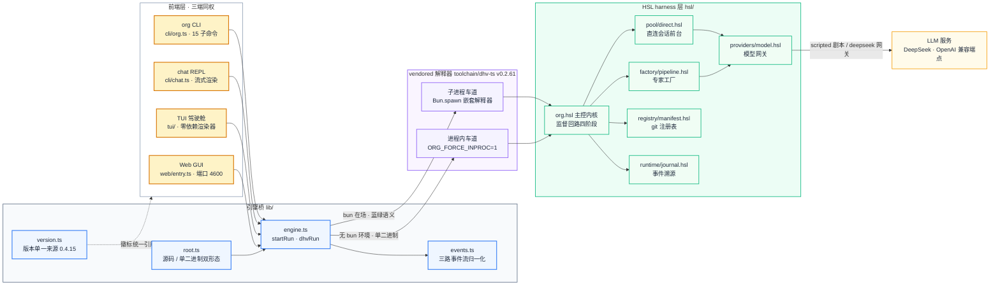
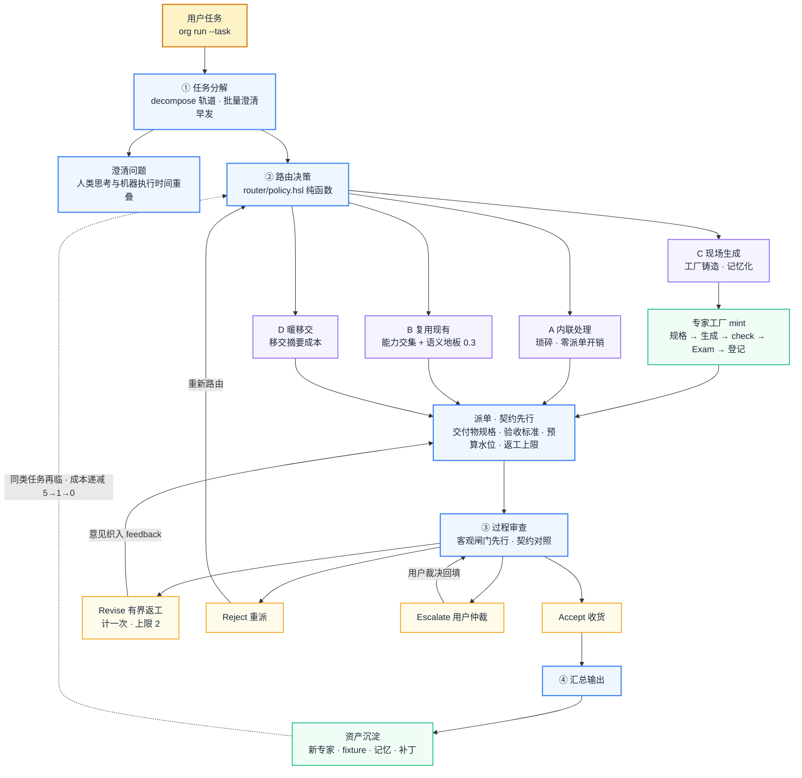
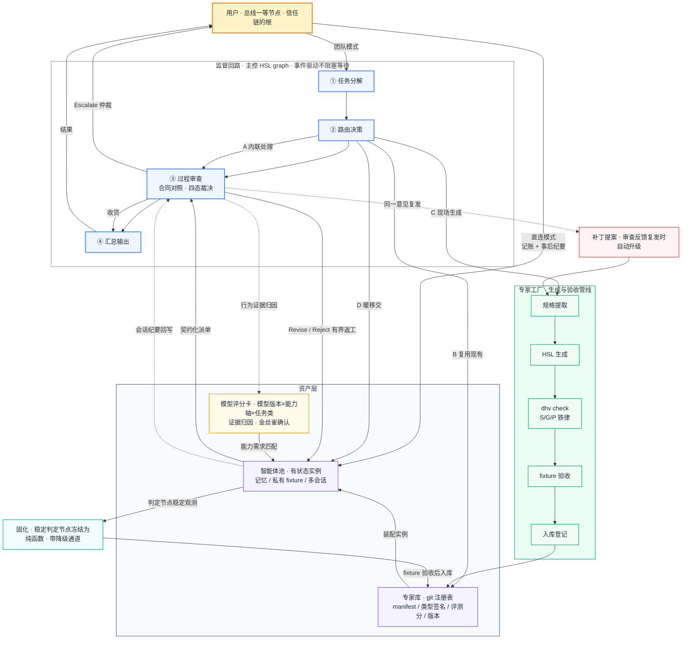
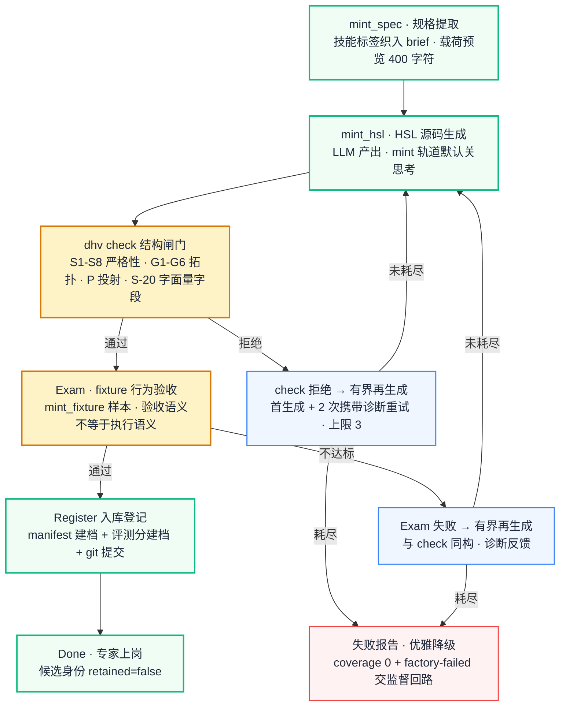
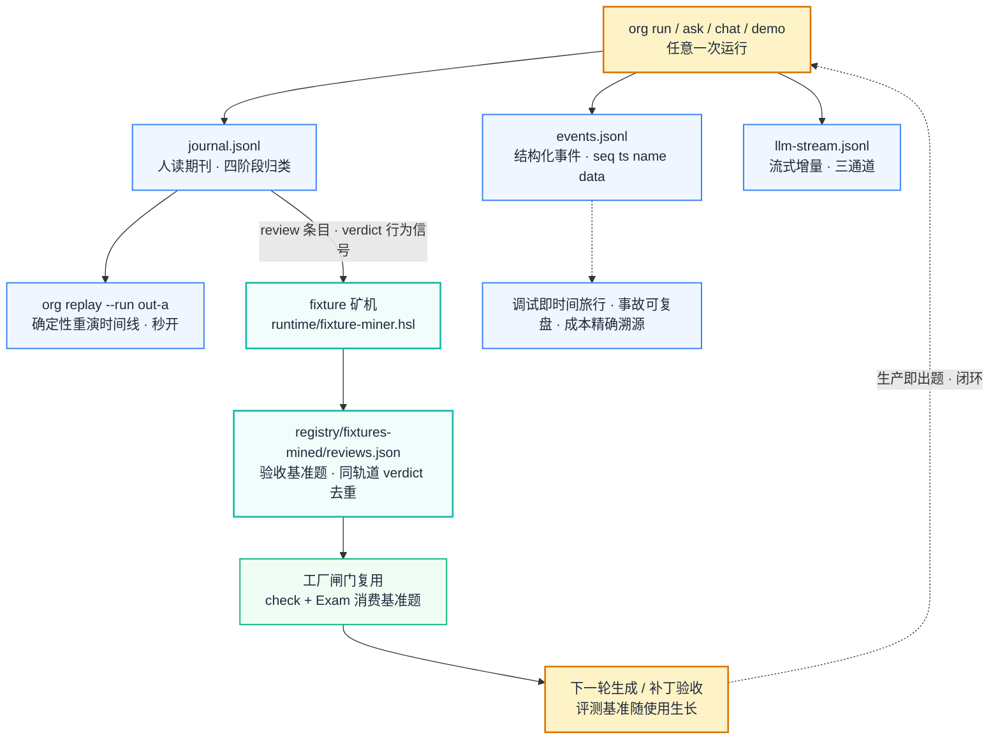

<div align="center">

# ORG — Organization Harness

**基于 HSL 的组织化多智能体系统 · 子智能体可生成、可验收、可复用、可演进**

[](LICENSE)
[](https://github.com/myh2026/org/releases)
[](#-测试与验证状态)
[](https://github.com/myh2026/harness-specification-language)
[](https://github.com/myh2026/harness-specification-language/blob/main/toolchain/hsl-spec/BNF.md)
[](#-三平台单二进制分发)
[](https://github.com/myh2026/org/actions/workflows/ci.yml)
[](https://github.com/myh2026/org/actions/workflows/release.yml)

</div>

---

> **一句话定位**：现有框架把子智能体当作一次性函数——任务结束即销毁，不留任何资产；ORG 把子智能体当作**工程资产**管理——结构用 HSL 语言描述、生成经编译期校验与 fixture 验收、任务结束沉淀回库，使系统能力随使用持续增强。

> **v0.5.0 当前状态**：可运行实现，**250/250 机制级测试全绿**（13 文件 · 981 expect）。本版对标 codex / zcode / opencode 补全两块：**Web GUI 补齐团队模式派单面**（`POST /api/run-stream` SSE + 运行卡片叙事 + 运行列表回放 + 评分卡面板 —— 此前 Web 只能直连单专家，旗舰监督回路在 Web 上完全不可见）与**agent 反悔通道**（`org session fork` 会话派生 · `org revert` 版本回退，回退本身可逆）；另把 11 类此前落 `unknown` 被三端静默丢弃的事件（审计 / 能力拒绝 / 金丝雀回滚 / 固化降级 / 静默更新告警 / 补丁回滚失败 / panic / llm_stream_done 用量…）具名化。解析契约单一化：新增 `lib/runCards.ts`，分类在服务端做，浏览器只渲染。（上版 v0.4.17 落地 `org review` 运行范围复核与四个实测缺陷修复。）

## 📑 目录

- [✨ 为什么是 ORG](#-为什么是-org)
- [🏗️ 总体架构](#️-总体架构)
- [🔁 org run：团队派单流程](#-org-run团队派单流程)
- [🏭 专家工厂：mint 流水线](#-专家工厂mint-流水线)
- [💬 交互式聊天 REPL 与流式输出](#-交互式聊天-repl-与流式输出)
- [🖥️ 组织驾驶舱（TUI）](#️-组织驾驶舱tui)
- [🌐 Web GUI](#-web-gui)
- [⚙️ 运行时动力学](#️-运行时动力学)
- [⚖️ 设计铁律](#️-设计铁律)
- [🧬 与 HSL 的关系](#-与-hsl-的关系)
- [🎓 创新点（毕业论文核心）](#-创新点毕业论文核心)
- [🆚 对标主流 Agent](#-对标主流-agent)
- [📂 文件结构树](#-文件结构树)
- [⚡ 快速开始](#-快速开始)
- [🔌 DeepSeek 真实模型接入](#-deepseek-真实模型接入)
- [🧰 CLI 全命令参考](#-cli-全命令参考)
- [🗂️ 工作区布局](#️-工作区布局)
- [✅ 测试与验证状态](#-测试与验证状态)
- [📦 三平台单二进制分发](#-三平台单二进制分发)
- [🧪 CI/CD](#-cicd)
- [🗺️ 实施路线图](#️-实施路线图)
- [📐 设计决策记录](#-设计决策记录)
- [❓ FAQ](#-faq)
- [🛡️ 已知边界（诚实声明）](#️-已知边界诚实声明)
- [🔭 Roadmap](#-roadmap)
- [🔗 文档导航](#-文档导航)
- [📄 License 与致谢](#-license-与致谢)

## ✨ 为什么是 ORG

现有 Agent 框架回答的是「怎么派一个子任务」，ORG 回答的是「怎么让子智能体成为可积累的组织能力」。它把四件通常散落在框架约定、提示词工程和人工经验里的东西，收进一个可校验的系统：

- **专家是流程，不是人设** —— 现有 sub-agent 体系的「专家」= 通用 ReAct 循环 + 系统提示词 + 工具白名单，只贡献人设不贡献流程。ORG 用 HSL `graph` 把专家的标准作业程序形式化为可校验的拓扑：node 是物理依赖、edge 是带守卫的消息通道、循环是有穷尽性要求的程序结构。主控与子智能体之间不再共用同一套运行时约定，只对齐类型化接口。
- **生成必须过闸门** —— 「现场生成一个智能体」在无验收体系的框架里等于把未经检查的代码直接上线。ORG 的生成管线规定：LLM 产出的 `.hsl` 源码必须先通过 `dhv check`（S 严格性 / G 拓扑 / P 投射铁律），再通过 scripted fixture 行为验收，才能注册上岗。机器生成的机器代码，第一次拥有确定性的质量闸门。
- **权限是编译期与审计事件的组合** —— `#[capability(...)]` 注解使最小权限原则在编译期可执行；运行期的临时授权、直连访问、能力变更全部作为审计事件记录。委托关系不再依赖提示词自觉，而是可检查、可追溯的工程约束。
- **任务结束是资产沉淀的开始** —— 每个任务都可能留下多类资产：新专家、验收 fixture、任务记忆、补丁记录。同样的任务第二次到来时，成本结构与第一次完全不同。系统的核心竞争力不在单次执行的聪明程度，而在资产层的增长率。
- **成熟流程固化为代码** —— 运行时把输出长期稳定的判定节点冻结为纯 HSL 函数（带自动降级通道），专家的单位成本随成熟度递减。agent 不只是会写代码，它会随着被使用而逐渐变成代码——HSL 是这个过程的编译目标。

## 🏗️ 总体架构

三前端（CLI / chat REPL / TUI / Web GUI）共享同一引擎桥与同一 HSL harness 层——**GUI 与 REPL 都只是薄渲染层，逻辑全部复用 CLI 同一代码路径**；引擎桥之下是 vendored 的 dhv-ts 解释器（子进程车道优先，无 bun 环境自动切进程内车道）：



### 六大部件

| 部件 | 职责 | 关键机制 | 落地 |
|:---|:---|:---|:---|
| **主控（编排与监督）** | 分解、路由、审查、汇总 | 事件拓扑（microkernel）；批量澄清早发；任务契约先行 | ✅ hsl/org.hsl |
| **路由器** | 每个子任务四选一 | 类型兼容静态可查；纯函数判定；语义地板防盲配 | ✅ hsl/router/policy.hsl |
| **专家库（Registry）** | 磁盘资产，不占运行时资源 | git 注册表；manifest 索引；能力交集 + 语义粗排检索 | ✅ hsl/registry/manifest.hsl |
| **专家工厂（Factory）** | 新品生成 + 补丁合入，同一闸门 | 提取 → 生成 → dhv check → fixture 验收 → 登记 | ✅ hsl/factory/pipeline.hsl |
| **智能体池（Pool）** | 运行中的有状态实例 | 生命周期状态机；双执行车道（进程内/嵌套=蓝绿） | ✅ 轻档 hsl/pool/lifecycle.hsl |
| **直连前台** | 用户可寻址池内专家 | 记账 + 纪要回写 + 会话账本强制执行 | ✅ 多轮 + 暖移交 hsl/pool/direct.hsl · handoff.hsl |

### 主控与监督回路

**主控是全系统唯一手写、唯一不经工厂管线的组件——它是内核。** 主控是一个 HSL `graph`，监督回路的四个阶段以事件拓扑组织（`registry → pool → policy → pool → journal → {pool, scorecard}`，环上全部带 on Guard）。

监督的核心机制是**任务契约**：派单前先写明交付物规格、验收标准、预算水位、返工上限与升级路径。审查因此成为「对照验收标准的有限动作」而非全程盯守，裁决为四态：

```
Accept（收货） │ Revise{意见}（返工，计一次） │ Reject{理由}（重派） │ Escalate（提交用户仲裁）
```

审查**客观闸门先行**（结构性优先于裁判）：预算遵守与覆盖率线是机械判定，只有机械闸门通过才进入语义裁决（模型对照验收标准）。审查只读**结构化状态报告**——契约是类型化结构，执行方无法把原始流水账塞进去，类型系统本身在强制摘要。

### 路由：四条路径

| 路径 | 适用条件 | 成本特征 |
|:---|:---|:---|
| **A 内联处理** | 琐碎任务、强依赖主控上下文 | 最低，无派单开销 |
| **B 复用现有** | 库中有类型兼容、语义匹配的专家（能力交集 + 亲和比例 ≥ 0.3 地板） | 摊销成本，随复用次数递减 |
| **C 现场生成** | 库中无匹配，且任务具备复用价值 | 生成 + 验收为一次性成本，完成后转为资产 |
| **D 暖移交** | 用户新请求落在既有专家职责内且规模小 | 一份上下文移交摘要的成本 |

两条工程事实：**C 路径是记忆化的**——注册表已有该专家时返工重派直接走磁盘车道，不重跑工厂（mint 的一次性成本由注册事实记忆）；**B 路径有语义地板**——技能标签命中 ≠ 语义匹配（`REUSE_AFFINITY_RATIO=0.3`：词面重合不足 30% 的复用请求被改道 C 现场生成，DeepSeek E2E 实测修复「情感任务被复用到公告解析器」的盲配）。

### 专家库（Registry）

库是磁盘上的资产层，形态为 **git 仓库作注册表**：版本管理、diff 审计、协作分享复用现有工具链，不发明新基建。每个专家条目六字段：

| manifest 字段 | 说明 |
|:---|:---|
| `interface` | graph 签名（信封契约，见下） |
| `capabilities` | 能力标签（与 `#[capability]` 注解对应） |
| `eval` | fixture 验收记录与评测分（补丁合入不得回退） |
| `version` | 语义版本 + 绑定的 BNF 版本（语言演进的漂移检测） |
| `stats` | 使用次数、裁决通过率、生成来源（工厂 / 人工 / 导入） |
| `provenance` | 补丁历史：每次变更的触发原因（对应哪次审查反馈） |

**工具库治理四动作（v0.4.4 起，v0.4.17 补齐第四动作，用户主权）**：

- **`org import <file.hsl>`（导入你自己的 harness）**：check 闸门（坏 harness 拒绝入库）→ 复制入 `registry/harnesses/<name>.hsl` → 注册 `source=import · retained=true`（导入即保留，B 路径自动复用立即可用）→ git 留痕（`import <name>@0.1.0 (user harness)`）。元数据自动提取：描述取文件首个 `///` 文档注释，能力取 `#[capability(…)]` 注解扫描；`--name / --description / --capability` 可显式覆盖。TUI 同构命令 `:import <file.hsl>`。
- **`org keep`（选取保留）**：工厂产出的新专家默认是**候选**（`retained=false`）——注册在库但不参与 B 路径自动复用；用户选取保留后转正。选取动作进 git 账本（`(user curation)` 提交，与 mint / patch / import 同链）。
- **`org drop`（取消保留）**：再次失联（显式寻址与 C 路径记忆化派单仍可用）。
- **`org review`（运行范围复核，v0.4.17）**：前三者按**名字**治理库里已有资产，review 按**运行范围**回答「这一次运行产出的东西里，哪些值得沉淀」——范围判据全部来自事件流（`journal:mint-register` 本次铸出 / `journal:asset` 的 `patch <name> :: note` 本次补丁合入 / `journal:dispatch` 的 `channel=reuse <name>` 本次复用命中），不靠目录时间戳猜测；缺省范围取**最近一次有 harness 产出的运行**（一次 demo 会连跑 out-a…out-c 再跑 out-direct/out-handoff，按字面最新选会永远命中最不相关那次）。交互选取：编号逗号分隔 / `a` 全选 / `n` 全不选 / 回车全选 / `q` 取消；非交互通道 `--keep a,b` / `--all` / `--none` / `--dry-run`，且 **stdin 非 TTY 且未给选取时不猜**（退出码 2 + 指路）。**选取只翻转 retained、不删任何文件** —— 未勾选候选保持 `retained=false`（B 路径自动复用不命中），源码 / fixture / 评分卡全部留在库里；「不保留」是可逆的降权而不是删除。`org demo` 的 K 相位在 TTY 下改为**真交互**（人在场就真的问用户选哪几个候选），非交互保持 scripted 全选。

「哪些 harness 值得留下来」是用户的决策权，不是系统的默认行为——导入、选取、反悔全部 git 留痕，构成资产层的增长率账本。专家标识三态：**★ 保留（retained）· ○ 工厂候选（minted）· ◆ 用户导入（import）**，CLI `org status` / chat `/expert` / TUI 专家栏 / Web GUI 专家卡四处理解同一语义。

**B 路径执行面（v0.4.6，导入 harness 被真实派单执行）**：`org import` 注册的 harness 不只能直连问答——任务派单（`org run` / demo 全叙事）命中 B 路径（`find_reusable` 能力交集 + 语义亲和）时，**导入的 harness 经嵌套解释器车道真实执行**。派单寻址注册表登记优先（`registry/harnesses/`，不再假设 `registry/experts/` 约定）。磁盘车道信封契约（导入 harness 作者须知）：

- **输入**：`factory/current-spec.json` 工单（goal / acceptance / payload / feedback；payload 为字符串字段——上游交付物或 raw 材料原文，JSON 语义由 harness 自行判定）。
- **输出**：`$host.artifacts.write("acceptance.json", …)` 验收工件——`coverage`（0..1）、`summary`、`note` 之外可声明 **`deliverable` 字段**（如 parse 专家的记录数组 JSON）：交付物经 `work/parse-output.json` 机械编接流转下游子任务（缺省占位符 `(validation verdict artifact)`，不编造数据）。

**上下文窗口计量（v0.4.4，Codex 风格）**：直连会话每轮把全部历史织入提示词——上下文占用随轮次单调增长，现在**可见**：每轮问答后打印 `[ctx] 窗口占用 ▓░░ 8.4k/131.0k（6.4%）` 计量条（GLM-4.5 窗口 128k tokens；chars/3 近似口径，非精确 tokenizer —— 诚实边界）；会话账本记录 `ctx_tokens` 字段；`direct_ctx` 事件上总线（TUI 直连卡实时渲染 meter，知情权不可绕）；`org status` 按会话汇总占用。

主控与专家之间的接口采用**信封契约**：外层统一为 `TaskSpec -> Result<Report, ExpertError>`（主控可无差别组合任意专家），payload 按领域自定义类型（专家保持表达能力）。全强类型会使生成端互相卡死，全自由文本会退化为黑盒，信封是两者的平衡点。

## 🔁 org run：团队派单流程



### 系统全景（监督回路 · 资产层 · 工厂 · 补丁 · 评分卡 · 固化）



怎么读这两张图：**上一张是 `org run` 的时间线**（用户任务的执行序列，Revise 的意见织入 feedback 重派）；**下一张是系统全景**——蓝色管线是监督回路（主控四阶段），紫色是资产层（库与池），绿色是工厂管线（生成与验收），红色是补丁通路，琥珀色是模型评分卡与证据归因，青色是固化通路。用户既是团队模式的委托方，也可以经直连通道直接访问池中专家；工厂同时服务两条生产线——新专家生成与老专家补丁，共用同一道验收闸门。

### 一次典型任务的走读（`org demo` 全叙事可复现）

1. 用户下达任务：「抓取某站点近一周公告，输出结构化表格」；
2. 主控分解为 检索 / 解析 / 校验 三个子任务，**随即**向用户发出澄清问题（输出格式、字段偏好）——人类思考时间与机器执行时间重叠，而非串行；
3. 路由：检索子任务琐碎且强依赖主控上下文 → **A 内联**；解析子任务在专家库命中 → **B 复用** notice-parser；校验子任务无匹配专家 → **C 现场生成**，生成物通过真实 `dhv check`（结构铁律）与 fixture 验收（行为闸门）后注册入池；
4. 派单契约先行：每份工单写明交付物规格、验收标准、预算水位与返工上限；
5. 主控过程审查发现校验专家覆盖不足，四态裁决为 `Revise`——在早期拦截，而不是汇总后发现全量返工；
6. 任务结束：**新专家以「候选」身份沉淀（retained=false）**；**用户选取保留**（`org review` 逐项复核 / `org keep` 直接选取；`org demo` 的 K 相位在交互终端下会真的停下来问用户选哪几个，非交互则 scripted 全选）→ 候选转正进 git 账本；验收样本、固化 memo 一并沉淀（git 注册表提交留痕）；
7. **第二次同类任务**（run B）：校验专家（已转正）直接复用（零工厂成本）；解析专家的日期归一化判定节点持续命中 memo（模型调用 5 → 1）；「覆盖不足」审查意见复发两次 → 自动升级为**补丁提案**，经 check + smoke 闸门合入 record-validator@1.0.1（git 留痕）；
8. **第三次同类任务**（run C）：判定节点 5/5 全命中（**零模型调用**）；补丁版专家首验即收（**零返工**）——蓝绿发布生效，系统单位成本随使用递减。

实测数据（scripted 模式，约 2.3s 全叙事）：model_calls 衰减 **5 → 1 → 0**，返工 **1 → 1 → 0**，git 注册表四个提交（template → mint → **keep（用户选取）** → patch）即资产层的增长率账本；另有多轮直连（2 轮问答、记账、会话账本、**每轮 `[ctx]` 上下文窗口计量条**）与暖移交（移交摘要 + 专家代答）两个通道产物。

## 🏭 专家工厂：mint 流水线

工厂管线五步（`hsl/factory/pipeline.hsl`，MintStage 状态机：ExtractSpec → GenerateSource → StructuralCheck → FixtureExam → Register → Done），全部可静态追踪，且**闸门是真的**（嵌套解释器子进程执行）：



- **`dhv check`**：S1–S8 严格性、G1–G6 拓扑、P 投射规则全量校验（v0.2.60 起含 S-20 struct 字面量未知/缺失/重复字段），结构不合格不允许进入下一阶段；
- **fixture 验收**：scripted 模式确定性重演，判定 = run.json ok **且** acceptance 覆盖率达标（验收语义 ≠ 执行语义——真实派单首轮低覆盖是合法的 Revise 语义）；
- **有界再生成（v0.4.12）**：`MAX_MINT_ATTEMPTS=3`（首生成 + 2 次携带诊断反馈的再生成，与监督回路有界返工 `DEFAULT_MAX_REVISES=2` 同构）——check 拒绝后把诊断信息反馈给生成器重试，耗尽才 Err（错误文案含次数与诊断）；
- **优雅降级**：工厂耗尽 → 失败报告（coverage 0 + factory-failed 标注）交监督回路（有界返工重试 / 耗尽后强制收货时失败标注随报告可见），不连累其余子任务；
- **入库登记**：manifest 建档、评测分建档、git 提交版本记录。

工厂同时承接**补丁流水线**：主控审查中同一意见对同一专家复发两次（`runtime/recurrence.json` 计数），反馈自动升级为补丁提案，过闸门后合入——变更分级闸门（提议权与合入权分离）：

| 变更类型 | 改动对象 | 闸门 | 落地 |
|:---|:---|:---|:---|
| 知识补丁 | 静态资源块 / 规则行 | `check` + smoke + 失败回滚 | ✅ |
| 流程补丁 | graph 拓扑关键词 | 全量 fixture 验收 + 评测分不得回退 | ✅ |
| 能力变更 | `#[capability]` 注解 | 审计事件，仅用户可批准（`ORG_CAPABILITY_APPROVED=1` 环境门） | ✅ |

**生成者与合入者分离**：主控（或任何 LLM）只有补丁提议权，按合并键的是验收管线（结构闸门不过即回滚）。运行中的专家实例不热改——补丁发布为新版本，在岗会话继续旧版，新派单自动加载新版（磁盘专家嵌套执行天然实现了蓝绿）。

### 智能体池（Pool）

池与库的区分：**库是磁盘上的档案（不占运行时资源），池是运行中的实例（占用并发额度）**。实例生命周期：

```
入编（工厂产出 / 外部导入） → 待命 → 派单（busy） → 审查 → 回到待命
```

- **双执行车道**：静态专家（随 ORG 发行，进程内 import）走进程内车道；磁盘专家（minted / 补丁后）走嵌套解释器车道——每次从磁盘加载最新版，即蓝绿发布语义；
- **热启动**：实例携带固化 memo（跨运行持久化的观测账本 + 冻结映射）上岗，同类任务的第二次执行在速度与质量上均优于冷启动；
- **演进档位**：轻档 = manifest + 任务历史索引（已落地）；重档 = 私有记忆工作台（路线图，依赖语言层 `pool` / `session` 语义）。

### 外部平台兼容（adapters）

ORG 不要求生态迁移——外部智能体以**导入线**接入注册表（`hsl/adapters/bridge.hsl`）：

| 平台 | 文件格式 | 探测特征 | 状态 |
|:---|:---|:---|:---|
| **Claude Code / Codex 式 subagent** | subagent JSON（name / description / tools / model） | `tools` + `model` | ✅ 导入登记 |
| **MCP**（Model Context Protocol） | MCP server manifest（name / instructions / tools） | `tools` + `instructions` | ✅ 导入登记 |
| **A2A**（Agent2Agent） | agent card（name / description / skills / url） | `skills` + `url` | ✅ 导入登记 |

v1 诚实边界：导入 = 注册表登记（manifest `source=import` + 能力标签 + 信封签名核对），每次导入是一条审计事件（知情权不可绕）；导入体的执行接线（协议翻译）是路线图项 —— 登记不等于在岗。

## 💬 交互式聊天 REPL 与流式输出

v0.4.15 把 ORG 从「批处理流水线」补齐为「真正的交互式 Agent」——对标 codex / opencode / zcode 的核心交互面，同时**零旁路**直连池的全部治理（事件上总线 · 花销记账 · 会话账本 · 纪要回写）：

```mermaid
%%{init: { "theme": "base", "themeVariables": { "primaryColor": "#FEF3C7", "primaryBorderColor": "#D97706", "primaryTextColor": "#1E293B", "lineColor": "#94A3B8", "fontSize": "14px", "fontFamily": "-apple-system, BlinkMacSystemFont, PingFang SC, 'Noto Sans SC', SimHei, sans-serif" }, "flowchart": { "curve": "basis", "padding": 20, "nodeSpacing": 45, "rankSpacing": 55, "htmlLabels": false } }}%%
flowchart LR
    IN["chat REPL 输入<br/>you 提示符 · 串行输入泵"]
    START["startRun<br/>entry=direct · 子进程车道"]
    DIRECT["pool/direct.hsl<br/>会话史织入提示词"]
    GW["providers/model.hsl<br/>stream:true + track 轨道归因"]
    HOST["$host.llm.complete<br/>vendored dhv-ts 宿主 · SSE 逐块解析"]
    API["OpenAI 兼容端点<br/>DeepSeek 官方 API"]
    STREAM["llm-stream.jsonl<br/>append-only 增量落盘"]
    PUMP["引擎泵 150ms 尾随<br/>lib/events.ts"]
    DELTA["llm_delta 事件<br/>reasoning / content / reset 三通道"]
    RENDER["REPL 逐 token 渲染<br/>thinking 指示器单行刷新"]
    LEDGER["会话账本落盘<br/>runtime/sessions/专家/会话.jsonl"]
    METER["ctx 计量收尾<br/>turn N · tokens · 耗时 · 思考 chars"]

    IN --> START
    START --> DIRECT
    DIRECT --> GW
    GW --> HOST
    HOST --> API
    API -->|"SSE 逐块"| STREAM
    STREAM --> PUMP
    PUMP --> DELTA
    DELTA --> RENDER
    DIRECT -->|"run 收尾整轮写账本"| LEDGER
    LEDGER --> METER

    classDef ui fill:#FEF3C7,stroke:#D97706,stroke-width:2px,color:#1E293B
    classDef hsl fill:#F0FDF4,stroke:#10B981,stroke-width:1.5px,color:#1E293B
    classDef infra fill:#EFF6FF,stroke:#3B82F6,stroke-width:1.5px,color:#1E293B
    classDef persist fill:#F5F3FF,stroke:#8B5CF6,stroke-width:1.5px,color:#1E293B
    class IN,RENDER,METER ui
    class DIRECT,GW hsl
    class START,HOST,PUMP,DELTA infra
    class STREAM,LEDGER persist
    class API ui
```



### org chat —— REPL 能力清单

- **多轮交互对话**：`org chat [expert]`，会话史跨轮织入提示词（磁盘会话账本 `runtime/sessions/<expert>/<session>.jsonl`）；专家缺省取首个保留专家（★，与 codex 缺省 agent 同构）；
- **Token 流式输出**：宿主流式车道（vendored dhv-ts v0.2.61）增量落盘 `llm-stream.jsonl` → 引擎泵尾随 → REPL 逐 token 渲染；**思考指示器**（`◈ thinking · N chars` 单行刷新，DeepSeek reasoning 通道分离实测）；**reset 通道**（网关重试车道观测面清屏重绘）；
- **斜杠命令**：见下表——模型热切换、专家热切换、会话管理一应俱全；
- **上下文压缩 `/compact`**：LLM 摘要会话史 → 账本重写为单轮摘要条目（`compacted:true, compacted_from:N`），原文件备份可手工回滚——主流 Agent 的 context compaction；
- **shell 逃逸**：`!cmd` 用户发起 · 结果直接可见（不经 harness 能力面）；
- **Ctrl+C 语义**：运行轮 = 取消当前轮（SIGTERM 子进程，本轮不落账本）；队列中 = 跳过待处理行；空闲 = 双击退出（Ctrl+D / `/exit` 同效）；
- **↑↓ 历史导航**：readline 原生 + 跨会话持久 `runtime/chat-history.txt`（500 条上限）；反斜杠续行多行输入；
- **readline 异步陷阱修复**：line 事件不等待 async 处理器——管道/粘贴多行输入时轮次会被跳过；输入队列 + 串行泵保证逐行完全落地；
- **`org sessions [expert]`**：跨专家会话账本清单（轮次 · tokens · ctx 窗口计量 · 最近问题）。

### chat REPL 斜杠命令表

| 命令 | 作用 | 说明 |
|:---|:---|:---|
| `/help`（`/h` `/?`） | 帮助 | 全部命令一览 |
| `/model [m]` | 查看/切换模型 | `scripted`（剧本秒回）· `deepseek`（网关 + 流式渲染） |
| `/expert [name]` | 查看/切换专家 | 无参列出注册表（★ 保留 · ○ 候选 · ◆ 导入）；切换自动接最近会话 |
| `/new [id]` | 新会话 | 缺省 `s-<时间戳>` |
| `/sessions` | 会话清单 | 本专家全部会话（轮次 · tokens · ctx 计量 · 最近问题，mtime 降序） |
| `/resume <id>` | 切换会话 | 跳回指定历史会话 |
| `/status` | 专家档案 | 名称/来源/能力/描述 + 当前会话统计（轮次 · 累计 tokens · ctx） |
| `/ctx` | 上下文占用 | 当前会话 ctx 计量条（`▓░░ 8.4k/131.1k（6.4%）`） |
| `/history` | 轮次回放 | 当前会话逐轮「问题 → 回答首行」，compact 轮有标记 |
| `/retry` | 重问 | 重发上一问题（失败轮不落账本，重试安全） |
| `/compact` | 上下文压缩 | LLM 摘要会话史 → 账本重写为单轮摘要（`compacted:true`），备份 `.bak-<ts>` 可手工回滚 |
| `/clear` | 清屏 | 重绘 banner |
| `/exit`（`/quit` `/q`） | 退出 | Ctrl+D 同效；会话账本保留（`org chat --continue` 接续） |
| `!<cmd>` | shell 逃逸 | 用户发起 · 结果直接可见（不经 harness 能力面） |

实测（DeepSeek 官方 API · deepseek-flash，scripted 剧本车道秒回）：

```
$ bun cli/org.ts chat
ℹ 未指定专家 → 取首个保留专家 notice-parser（/expert 切换）
ORG — Organization Harness v0.4.15 · chat
专家 notice-parser · 会话 default（0 轮） · 模型 scripted · demo-run

you⟩ [notice-parser] 上周抓取任务的字段映射规则是什么？
notice-parser⟩ 上周抓取任务的字段映射规则：标题/日期/部门取自块内「字段: 值」行；
  分类由标题关键词判定；日期经 norm_date 判定节点归一化为 ISO 8601……
  turn 1 · 55 tokens · 0.1s
  notice-parser · turn 1 · ctx ▓░░░░░░░░░░░ 89/131.1k（0.1%）
you⟩ /model deepseek
⟳ 模型 → deepseek
you⟩ 用一句话解释金丝雀发布
◈ thinking · 889 chars
notice-parser⟩ 金丝雀发布是先把新版本……          （逐 token 流式浮现）
  turn 2 · 47 tokens · 1.7s · 思考 889 chars
```

### 流式基础设施（观测面三端贯通）

- **宿主**（vendored dhv-ts v0.2.61 同步）：`$host.llm.complete` 补 `stream/track` 参数；SSE 逐块解析；reasoning/content/reset 三通道增量 append-only 落盘；`llm_stream_done` 事件；空正文可诊断（reasoning_chars）；
- **模型网关**（hsl/providers/model.hsl）：deepseek 车道一律带 `stream:true + track`（轨道归因贯通到每条增量）；返回值仍为完整正文，HSL 语义零变化；
- **引擎泵**（lib/engine.ts + lib/events.ts）：150ms 尾随 `llm-stream.jsonl` → `llm_delta` 事件（三通道）并入归一化事件流；
- **Web GUI**：askStreamOnce 加 llm-stream 尾随泵（120ms）→ SSE `delta` 事件；GUI 思考指示器 + 逐 token 正文渲染 + reset 清屏重绘（scripted 车道回退 stdout 行流，行为不变）；
- **TUI**：llm_delta 走 default 分支优雅忽略（事件卡面向 run 叙事，不炸）。

## 🖥️ 组织驾驶舱（TUI）

`org tui` 打开三区布局的产品级终端界面（零依赖自研渲染器，规格见 [docs/tui-spec.md](docs/tui-spec.md)）：

```
╭ ORG — Organization Harness ────────────────────────────── v0.4.15 ╮
│  ▾ 会话 (5)          │  org 任务分解 → 3 子任务                       │
│    ● 抓取某站点近…    │     ├ task#1 fetch   [A 内联] ✓               │
│    ○ (direct) 多轮…  │     ├ task#2 parse   [B 复用] notice-parser ✓  │
│  ▾ 专家库 (2)        │     └ task#3 validate [C 生成]                 │
│    ◆ notice-parser   │                                               │
│    ◆ record-valida…  │  ⚙ 工厂  规格 → 生成 → ✓check → ✓验收 → 登记git │
│  ▾ 池与固化          │                                               │
│    池    idle 2      │  ◆ review [Revise] · 覆盖率 0.80 < 0.95        │
│    固化  冻结0·命中5  │  ◆ review [Accept] · coverage 1.00            │
│    memo 3 条冻结映射  │  ✓ 汇总  交付物 3 · model_calls 5→1→0          │
├─ › 输入任务或 :命令…          团队模式 · scripted · idle ─────────────┤
╰──────────────────────────────────────────────────────────────────────╯
```

- **事件卡片流**：任务分解（A/B/C/D 路由徽标四色）· 工厂五步 stepper · 四态裁决徽标（Accept 绿 / Revise 琥珀 / Reject 红 / Escalate 紫）· 固化（❄冻结 ⚡命中）· 补丁（版本 bump + git sha + 金丝雀确认）· 用户选取（★ 保留 / ○ 候选）· 直连 · 完成卡（成本衰减 5→1→0）· 系统卡；
- **输入协议**：任务回车派单（团队模式）· `?专家 问题?` 直连 · `:demo` 全叙事演示 · `:keep <name>` / `:drop <name>` / `:import <file.hsl>` / `:review [all]` 工具库治理（keep/drop 无参作用于专家栏选中项；import 为 check 闸门 → 入库即保留可复用；review 汇总本次运行待决策候选，`:review all` 一键沉淀，逐项选取走 CLI/Web——三端同一套 `reviewCandidates`/`applyReview`）· `:replay out-…` 历史会话秒开重演（不重跑引擎）· `:filter 任务|分解|工厂|裁决|直连|汇总|动态` 事件流过滤（视图偏好，不随 run 重置）· `:score :theme :status :clear :help :quit`；
- **三主题**（org-dark / org-light / paper）· 窄终端降级 · 帮助浮层（`?`）· 运行取消（Esc）；
- **键盘**：Tab 切换分区 · j/k 移动 · g/G 回顶回底 · Ctrl+L 清屏 · Ctrl+C 退出；
- 实现与规格：`tui/`（零依赖 Line/Span 渲染器 + useReducer 单 store），冒烟测试 `bun run tui:smoke`（离屏 20 断言，CI 无 TTY 可跑）。

## 🌐 Web GUI —— `org web`

`org web` 起零依赖轻量 HTTP（Bun.serve，默认端口 4600，`--port N` 覆盖，只听 127.0.0.1），单页内联 HTML（无静态文件 / 无第三方依赖，原生 fetch 交互）。设计语言参考 OpenAI Codex CLI 的终端美学：**安静、致密、可工程信任**——近黑 zinc 色板 + 1px 发丝边框 + 等宽 chrome + tmux 式底部状态栏 + `❯` 提示符转写行（无气泡）+ 运行日志终端窗口；无渐变无辉光，emerald 是唯一功能色。GUI 只是薄渲染层——逻辑全部复用 CLI 同一代码路径：

```
┌ org · v0.4.15 · /…/demo-run ───────── experts 3 · 12 turns ──┐
│ SESSIONS            │ ❯ 写一首关于秋夜湖面的四行现代诗          │
│  + 新会话            │ org · poet · turn 1 · 19 tok · 48 ms     │
│  sprint-42 · 2 轮   │ 月光在湖面铺开银箔，                     │
│  default · 1 轮     │ 几片落叶，轻点涟漪，                     │
│ EXPERTS             │ ▸ run log 12 行                          │
│  poet @0.1.0 import │ ┌────────────────────────────────────┐  │
│  notice-parser@1.0  │ │ ❯ 输入问题…（enter 发送 · esc 停止）│  │
│  record-validator…  │ │ [scripted|deepseek]        [发送]  │  │
└─────────────────────┴─┴────────────────────────────────────┴──┘
 org · expert poet · model scripted · session sprint-42 · ○ idle
```

- **转写式消息流**：用户消息 = `❯` 提示符行；助手消息 = `org · 专家 · turn · tokens · 耗时` 元信息行 + 正文 + run log 终端窗口（`▸` 折叠展开 · 行计数徽标）；运行中 = braille 旋转 + 流水线阶段行 + 逐行实时日志；**v0.4.15 起逐 token 正文渲染 + 思考指示器**（SSE `delta` 事件）；
- **Markdown 渲染（v0.4.11）**：零依赖 `renderMd`（服务端导出可单测，`fn.toString()` 注入 GUI 同一实现）：围栏代码块（语言标签 + 块级 copy 钥）· 表格 · 嵌套列表 · 引用 · h1-h4 · 分割线 · 行内粗/斜/删/行内码/链接；流式期间即渐进渲染（未闭合围栏 EOF 容忍）；XSS 优先：全量转义后再还原受控标签，链接仅 http(s)；
- **消息级操作**：每轮「复制」+ 末轮「重发」（账本为事实源，重发 = 追加新轮次，不篡改历史）+ 代码块级 copy；hover 浮现不抢视觉；
- **会话搜索 · 移动端抽屉 · 快捷键**：侧栏过滤框（id / 首问预览匹配）；≤720px 抽屉侧栏（菜单钮 + 遮罩）；`⌘K`/`Ctrl+K` 新会话 · `/` 聚焦输入 · `Esc` 停止；
- **正常 Agent 功能面**：停止生成（`POST /api/abort` SIGKILL 子进程，该轮不落账本）· **排队轮预取消（v0.4.14）**（排队等待期 `Esc` 取消本轮：票据 id 寻址，不误伤运行中的前一轮；取消轮从不开跑、不落账本，流以 `error{aborted,queued}` 收尾）· 失败重试（错误块按钮，失败轮不落账本安全重发）· 会话重命名（行内编辑，`PATCH` mv 账本）· 会话删除（两步确认，`DELETE` 删账本文件）· 导出会话 Markdown · 模型切换（scripted/deepseek 分段控制）· 智能滚动（底部跟随 + 「回到最新」）· 空态终端 banner；
- **只读端点**：`GET /api/status`（专家清单 + 会话上下文占用 + 服务级 model，与 `org status` 同数据源）· `GET /api/sessions?expert=X` · `GET /api/session/<E>/<S>`（逐轮 question/answer/tokens/ctx_tokens，账本健壮解析）；
- **工具库治理端点（v0.4.12）**：`POST /api/keep` / `POST /api/drop`（body `{expert}`）——与 CLI `org keep` / TUI `:keep` 同一代码路径（`setRetained`：翻转 retained + 双写注册表 + git「(user curation)」留痕）；专家卡 hover 浮现 ★/○ 切换钮，导入专家免切换，运行中禁用；
- **团队模式端点（v0.5.0）**：`POST /api/run-stream`（SSE 团队派单：`open → start → run → card* → done/error`，card 帧携带 `{ev, fact}` —— 分类在服务端做，浏览器只渲染）· `GET /api/runs`（运行产物列表，TUI 会话栏同源）· `GET /api/run?dir=`（只读回放，`SAFE_NAME` 守卫）· `GET /api/score`（评分卡）；`POST /api/abort` 对团队 run 走 `RunHandle.cancel`（SIGTERM）
- **运行范围复核端点（v0.4.17）**：`GET /api/review`（本次运行接触面 + 待决策候选 + 已保留上下文）· `POST /api/review`（body `{run, keep:[名]}`）——与 CLI `org review` 同一代码路径（`reviewCandidates` + `applyReview`）；**越界名 409 明确拒绝**并回传 `allowed` 集合（客户端状态过期时不静默生效一部分）；GUI 顶栏「待复核 N」徽标 → 勾选面板（全选/全不选/已选计数/确认沉淀）→ git「(user curation)」留痕；
- **交互端点**：`POST /api/ask`（JSON 整轮，兼容并存）· `POST /api/ask-stream`（SSE 流式：`open`（排队状态 + `ticketId` 回显）→ `start` → `stage*`（2.6s 轮换 direct.hsl 真实阶段）→ `log*`（子进程 stdout 逐行实时）→ `delta*`（v0.4.15 逐 token）→ `done`/`error{aborted?,queued?}`；客户端意外断开不中止运行，显式停止/取消走 `/api/abort`）· `DELETE/PATCH /api/session/<E>/<S>` · `POST /api/abort`（停止/取消：无 body 停运行轮，`{id}` 取消排队轮）；
- **model 回落链**：请求体显式传 > 服务级（`org web --model deepseek`）> scripted——GUI 分段控制即请求体逐次覆盖；
- **deepseek 网关路由**：`org web --gateway http://127.0.0.1:3030/v1`（或环境变量 `DHV_LLM_GATEWAY`）把 `$host.llm` 指向 OpenAI 兼容端点——独立部署无需本机装 z-ai-web-dev-sdk；启动横幅回显网关地址 · 模型名 · 鉴权状态（防「配了没生效」）；
- **实现**：`web/entry.ts`（进程内 import，与 tui 同模式；`startWebServer` 可编程入口供测试用随机端口）+ `web/gate.ts`（AskGate 排队票据化）；expert/session 名白名单校验（防路径穿越）；测试 `bun test tests/web.test.ts`；
- 擂台/对比方向已退役（issue #10 收口）：仓库只保留 Agent 本体。

## 🧭 三端能力矩阵（诚实对照）

ORG 有三个前端：Web GUI（`org web`）· TUI 驾驶舱（`org tui`）· chat REPL（`org chat`），
外加 CLI（`org <cmd>`）。**它们的能力并不等价** —— 下表是当前真实状态，
`✔` 完整 · `◐` 部分 · `—` 无。v0.5.0 补的是最刺眼的那一格（Web 的团队模式）。

| 能力 | CLI | Web GUI | TUI | chat REPL |
|:---|:---:|:---:|:---:|:---:|
| **团队模式派单**（监督回路） | ✔ `org run` | ✔ v0.5.0 `/api/run-stream` | ✔ 任务回车 | — |
| 直连单专家问答 | ✔ `org ask` | ✔ SSE 流式 | ✔ `?专家 问题?` | ✔ 每行即一问 |
| 暖移交 handoff | ✔ | — | — | — |
| 事件卡片叙事（路由/裁决/工厂/固化/补丁/done） | ◐ stdout | ✔ v0.5.0 | ✔ 九类卡片 | — |
| 运行产物列表 + 只读回放 | ✔ `org replay` | ✔ v0.5.0 侧栏「runs」 | ✔ `:replay` | — |
| 评分卡 | ✔ `org score` | ✔ v0.5.0 面板 | ◐ `:score` | — |
| 工具库治理 keep / drop | ✔ | ✔ 专家卡 ★/○ | ✔ `:keep` `:drop` | — |
| 运行范围复核 review | ✔ 交互选取 | ✔ 勾选面板 | ◐ `:review all` | — |
| 导入 harness | ✔ | — | ◐ `:import` | — |
| **会话派生 fork** | ✔ v0.5.0 | — | — | — |
| **版本回退 revert** | ✔ v0.5.0 | — | — | — |
| 会话改名 / 删除 | ✔ v0.5.0 | ✔ | — | — |
| 会话列表 / 恢复 | ✔ | ✔ | ◐（列表是 out-*） | ✔ `/sessions` `/resume` |
| 上下文计量 + 压缩 | ✔ | ◐ 计量 | ✔ 计量 | ✔ `/ctx` `/compact` |
| 模型切换 | ✔ `--model` | ✔ 分段控制 | — | ✔ `/model` |
| 配置 / API key（`org config`） | ✔ | — | — | — |
| 能力审批（`--approve-capability`） | ✔ 运行前 | — | — | — |
| 主题 / 事件过滤 | — | — | ✔ `:theme` `:filter` | — |

**已知不一致（后续批次）**：Web 缺 import / handoff / demo / config 面板；
TUI 缺 `:model`、会话改名删除、`j/k` 滚动（帮助里写了但未实现）；
chat 缺 `review / keep / score / runs` 等命令。三端的会话账本读取目前各有一份实现，
计划收敛到 `lib/sessions.ts`。

## ⚙️ 运行时动力学

### 固化管线（Crystallization）—— 精确匹配档 + 自动降级已落地

专家 graph 的节点分两类：**判定节点**（需要 LLM 的开放判断）与**机械节点**（确定性变换）。运行时持续记录判定节点的输入输出对：

- **固化条件（v1）**：规范化后的输入在 N 次观测中（跨运行持久化的观测账本）始终映射同一输出 → 冻结 input→output；
- **命中监控**：冻结入口的命中 / 未命中计数；命中率持续归因到评分卡；
- **降级是生命线**：冻结函数的命中率因输入分布漂移而下降时（热启动 + 命中率 < 0.4），自动解冻最旧键、并把**本轮新冻结的键回退到观测态**（漂移期间学习降速，防污染），记审计事件（`crystallize_degrade`）；
- **语义等价固化后置**：v1 仅支持规范化精确匹配（已知边界）。

固化改变了成本结构：**成熟流程的单位成本随复用次数递减**。实测：notice-parser 的日期归一化判定节点，三连跑的模型调用 **5 → 1 → 0**。

### 事件溯源与确定性重放

事件总线的全部事件 append-only 留痕：**`events.jsonl`**（结构化事件 `{seq, ts, name, data}`）+ **`journal.jsonl`**（人读期刊 `seq|ts|phase|actor|action|detail`，按监督回路四阶段归类）+ **`llm-stream.jsonl`**（v0.4.15 流式增量 `{ts, track, kind, delta}`，三通道）。`org replay --run <dir>` 重演时间线；scripted 剧本即当时的模型响应录制——**确定性重放 = 日志 + 代码版本**。



journal → fixture 沉淀（`runtime/fixture-miner.hsl`，生产即出题）：真实运行的审查裁决（行为证据）自动挖掘为验收基准题——评测基准的来源从「自动生长 vs 人工种子」的二选一，变为结构性解。挖掘面：监督回路的 review 期刊条目（`detail = "task#<id> <role> verdict=<V> coverage=<C>"`），同轨道 verdict 重复只保留一条，产物落 `registry/fixtures-mined/reviews.json`。

### 模型能力评分卡（Scorecard）

每个模型版本一张卡：能力轴 × 任务类矩阵，每格 = 分数 + 置信度（样本量）；`evidence_count` 是跨运行的累计归因条数（`registry/scorecards/evidence-ledger.json` 增长账本），cells 分数始终是当期窗口聚合。**证据分级**是核心纪律——客观行为信号结构性优先于裁判打分：

| 证据 | 来源 | 状态 |
|:---|:---|:---|
| fixture 考试通过率 | 工厂验收 | ✅ |
| Revise / Reject / Escalate 率 | 监督四态裁决 | ✅ |
| 契约预算遵守率 | 预算水位 | ✅ |
| 固化命中率 | 固化管线观测 | ✅ |
| 直连会话用户接受度 | 直连通道 | ✅ |
| 影子对比得分（裁判档，权重 0.5） | 晋升管线 | ✅ |
| 金丝雀确认 | 验收样本双跑 | ✅ |

### 影子晋升与 N 版本冗余 —— 已落地

- **影子晋升（金丝雀）**：补丁版本合入后，旧版本源码自动归档（`<name>@<from>.hsl`）；候选与在岗版本在验收样本上同输入双跑（产物目录隔离），`(ok, coverage, valid, total)` 全一致 → `canary_confirmed`；任一指标分歧 → `canary_rollback`（归档源写回 + manifest 降版）；
- **静默更新检测**：当期评分卡 vs 基线（`registry/scorecards/baseline-<model>.json`）逐格对比，劣化超阈值 → `score_drift_alert` 审计事件（诚实边界：任务分布漂移同样触发，告警需人工复核归因）；
- **N 版本冗余**（`ORG_REDUNDANCY>=2`）：向实现来源多样的专家对（不同 `source` / 不同 `version`）镜像派单，产出一致置信度加成，分歧记健康度事件（`redundancy_compare`；按执行计次——返工轮是第二次真实执行，同样触发对比）。

## ⚖️ 设计铁律

1. **调度权可绕，知情权与记账权不可绕。** 直连不是旁路：总线可见、预算入账、纪要回写，三者不可协商。
2. **权限跟随委托链。** 编排模式适用静态最小权限；用户亲自委托时适用用户自身的权限范围；能力天花板的调升只属于用户。
3. **天花板管缺席，确认管在场。** 用户不在场的执行用静态能力约束兜底；用户在场的执行用动态确认替代静态天花板。
4. **同一意见第二次出现，修专家本体，不是再退回一次。** 审查反馈的复发自动升级为补丁提案，进入与新品生成相同的验收管线。
5. **裁决者不自我裁决，主控是内核。** 主控可提案修改专家，不可修改自身的编排图与审查标准。
6. **客观证据结构性优先于裁判证据。** 审查的客观闸门（预算/覆盖率）先于语义裁决；评分卡行为信号权重高于裁判打分。

## 🧬 与 HSL 的关系

ORG 是 [HSL（Harness Specification Language）](https://github.com/myh2026/harness-specification-language)的旗舰应用：主控、工厂管线、专家本体全部以 HSL 编写，运行于 dhv-ts 解释器。当前基于 **BNF v1.5.0** 严格文法，不依赖未发布的语言特性；仓库 vendored **dhv-ts v0.2.61**（`toolchain/dhv-ts/`，克隆即跑，零环境依赖）。

开发过程中对 HSL 做了多次真实实测并回推修复（详见 [BUGFIXES.md](BUGFIXES.md) 与上游 CHANGELOG）：`Vec::iter_mut` 与 `String::push(char)` 缺失于解释器内建方法面；i64 位运算 BigInt 语义；`String::find` 码点索引；S-20 struct 字面量字段校验；`nextReview` 耗尽抛错；`fs.list` 深度可配；路径监狱 symlink 实解析；流式 `stream/track` 参数。

同时，ORG 的设计对 HSL 提出了演进需求（BNF v1.6 路线图）：`node user: Human` 人在环节点、`pool`/`session` 实例语义、并发原语、`#[expose]` 注解、G7 返工环有界、G8 失败拓扑穷尽、G9 预算可行性——把组织管理中的经验教训转化为拓扑校验规则。

## 🎓 创新点（毕业论文核心）

> 每条创新点附一句**实证**——全部来自本仓库真实代码、`org demo` 可复现叙事、205 个机制级测试与 DeepSeek 官方 API 的 E2E 实测记录（详见 [✅ 测试与验证状态](#-测试与验证状态)）。

1. **Harness 即代码** —— 专家不是「提示词 + 工具白名单」，而是用 HSL 语言（BNF v1.5.0 严格文法）描述的可编译校验程序：node 是物理依赖、edge 是带守卫的消息通道、`#[capability]` 注解在编译期执行最小权限。**实证**：`org check` 对 hsl/ 源码 + dist/ 铸出专家共 34 个模块执行 dhv check（S1–S8 / G1–G6 / P 铁律 + S-20 字面量字段）全绿；v0.4.12 DeepSeek 实测中基座模型产出的 Rust 风格「harness」被结构闸门正确拒绝。
2. **组织化多智能体监督回路** —— 分解 → 路由 → 派单（契约先行：交付物规格/验收标准/预算水位/返工上限）→ 审查（客观闸门先行 + 四态裁决 + 有界返工）→ 汇总 → 资产沉淀，主控为唯一手写内核，事件拓扑 microkernel。**实证**：`org demo` 全叙事 2.3s 复现 model_calls **5 → 1 → 0**、返工 1 → 1 → 0；README 走读与动力学点火测试逐条断言（tests/demo.test.ts 25 例 + dynamics.test.ts）。
3. **专家工厂：现场铸造 + 双闸门 + 有界再生成** —— LLM 产出的 `.hsl` 必须过 `dhv check`（结构闸门）与 scripted fixture Exam（行为闸门）才可注册上岗；check/Exam 失败均携带诊断反馈有界再生成（`MAX_MINT_ATTEMPTS=3`），耗尽优雅降级交监督回路而不炸全场。**实证**：DeepSeek 官方 API E2E 全链路 mint → check → Exam → Register → Done 以 **176s** 完成（v0.4.13 实测；修复前 560s 超时失败）。
4. **工具库治理：用户主权三动作** —— `org import`（导入自有 harness：check 绿才入库、即刻可复用）/ `org keep`（工厂候选转正）/ `org drop`（反悔），★ 保留 · ○ 候选 · ◆ 导入三态，CLI / TUI / Web GUI 三端同权，全部 git 留痕。**实证**：`org demo` 的 git 注册表四提交链 template → mint → **keep（user curation）** → patch 即资产层增长率账本；keep/import 专项测试（tests/keep.test.ts + tests/import.test.ts）。
5. **事件溯源与确定性重放** —— 三路 append-only 留痕（events.jsonl / journal.jsonl / llm-stream.jsonl），scripted 剧本即当时的模型响应录制，「日志 + 代码版本」即可确定性重放；journal → fixture 矿机把生产审查裁决沉淀为验收基准题（生产即出题）。**实证**：`org replay --run demo-run/out-a` 秒开重演；demo 产物 `registry/fixtures-mined/reviews.json` 由矿机按轨道去重产出。
6. **三层降级复用（A 内联 / B 复用 / C 记忆化）** —— 路由纯函数四选一；B 路径能力交集 + `REUSE_AFFINITY_RATIO=0.3` 语义地板防「技能标签命中 ≠ 语义匹配」盲配；C 路径记忆化：注册表已有专家时返工重派直接走磁盘车道不重跑工厂。**实证**：demo 三连跑中 run B 零工厂成本复用已转正的 record-validator；DeepSeek E2E 中词面重合仅 9% 的情感任务被地板正确改道工厂（v0.4.13 实测修复，tests/fixes.test.ts 断言）。
7. **治理铁律：调度权可绕，知情权与记账权不可绕** —— 团队/转接/直连三通道共享事件总线、独立记账科目、纪要回写三件不可协商义务；权限跟随委托链；能力天花板调升仅属用户（`ORG_CAPABILITY_APPROVED=1` 环境门）。**实证**：每次直连发 `direct_open`/`direct_close` 事件 + `direct-ledger.jsonl` 独立记账 + `runtime/direct-memos.md` 纪要回写；chat REPL 零旁路复用同一治理（v0.4.15）。
8. **观测面三端贯通 + Codex 风格 ctx 窗口计量** —— CLI chat 流式 REPL / TUI 驾驶舱 / Web GUI（SSE）三端共享同一事件流与 token 级流式（reasoning / content / reset 三通道）；每轮 `[ctx] ▓░░ 8.4k/131.1k（6.4%）` 计量条 + 账本 `ctx_tokens` 字段 + `/compact` 上下文压缩。**实证**：DeepSeek E2E：chat REPL 思考 889 chars 流式指示 → 逐 token 正文 → `turn 1 · 47 tokens · 1.7s`；Web GUI 160 个 SSE delta 事件；848 行增量（1 reset + 357 reasoning + 490 content）保序落盘。
9. **零依赖单二进制分发** —— `bun build --compile` 五目标交叉编译（linux-x64/arm64 · darwin-x64/arm64 · windows-x64）；hsl 源码 + vendored 解释器 + 工作区模板 + 剧本打包为 `build/payload.json` 随二进制分发，运行期按内容指纹解包 `~/.org/runtime-<sha1>/`；无 bun 环境自动切进程内车道（`$host.dhv.{check,run}`）。**实证**：无 bun 单二进制实测 `check` 全过 + 全叙事 `demo` 完整通过；`lib/version.ts` 版本单一来源根治「发版后某入口徽标忘改」的结构性漂移（v0.4.14 治理批次）。
10. **双模型车道：scripted / deepseek** —— scripted 剧本轨道（`$host.fixture.next(track)` 按轨道名 + 序号消费）使全部机制 CI 可复现零外联、轨道名即观测面；deepseek 车道走 `$host.llm` 网关（OpenAI 兼容：鉴权 + 模型路由 + 超时 + 思考量控制 + 429 有界退避 + 流式 + 轨道归因）。**实证**：205 个机制级测试全绿零外联；DeepSeek 官方 API（deepseek-flash）直连问答 3.4s、团队模式全链路 176s（v0.4.13 E2E）。

## 🆚 对标主流 Agent

与 codex / opencode / zcode 等主流终端 Agent 的交互面对标（ORG v0.4.16）：

| 维度 | codex | opencode | zcode | **ORG** |
|:---|:---|:---|:---|:---|
| 交互式 REPL | ✅ | ✅ | ✅ | ✅ `org chat`：多轮对话 · 串行输入泵 · readline 历史 |
| Token 流式输出 | ✅ | ✅ | ✅ | ✅ 三通道（reasoning / content / reset）逐 token，`llm-stream.jsonl` append-only 落盘 |
| 会话管理 | ✅ | ✅ | ✅ | ✅ 磁盘账本 `runtime/sessions/<expert>/<sid>.jsonl` + `/sessions` `/resume` + `org sessions` |
| 上下文压缩 | ✅ compact | ✅ | ✅ | ✅ `/compact`：LLM 摘要 → 账本重写为单轮（`compacted:true`）+ 备份可回滚 |
| 模型热切换 | ✅ `/model` | ✅ | ✅ | ✅ `/model` + 网关环境变量（OpenAI 兼容服务商即插即用） |
| 模型/API 持久配置 | ✅ `~/.codex/config.toml` | ✅ `opencode.json` | 未见公开口径 | ✅ `org config`：`~/.org/config.json` + 六服务商预设（deepseek/openai/openrouter/ollama/lmstudio/vllm）+ 来源归因 + `org config test` 连通验证 + `default_lane` 缺省车道 |
| 审批治理 | 部分（权限模式） | 部分 | 部分 | ✅ capability 三态（auto/confirm/deny）+ 权限跟随委托链 + 审计事件 + 能力变更仅用户批准 |
| 事件溯源 | 运行日志 | 运行日志 | 运行日志 | ✅ journal 期刊（四阶段归类）+ **确定性重放** `org replay` |
| 多智能体 | subagent 派发 | agent 配置 | agent 配置 | ✅ 组织化四阶段监督回路 + 派单契约 + 四态裁决 + 有界返工 |
| harness 即代码 | 配置文件/提示词 | 配置文件 | 配置文件 | ✅ HSL 严格文法（BNF v1.5）+ `dhv check` 编译期闸门 |
| 生成即资产 | ❌ 会话结束即弃 | ❌ | ❌ | ✅ 工厂现场铸造 + keep/drop/import 用户治理 + git 注册表版本链 |
| 单二进制分发 | ✅ | ✅（npm 安装） | 未见公开口径 | ✅ bun compile 五目标 + payload 资源内嵌（无运行时依赖） |
| 测试可复现性 | 部分 | 部分 | 部分 | ✅ scripted 剧本车道：205 测试 CI 零外联全绿 |

> 口径说明：codex / opencode / zcode 列基于各工具公开文档与默认行为的概括性判断（2026-09），「部分」表示该能力存在但非本表所述形态；ORG 列全部可在本仓库复现。ORG 的差异化不在交互面 parity（v0.4.15 已补齐，v0.4.16 补模型持久配置），而在**资产层**：子智能体可生成、可验收、可复用、可演进。

## 📂 文件结构树

```
org/
├── hsl/                                # ✦ HSL 源码层（人写 · 全部 .hsl 单列此层）
│   ├── org.hsl                         #   主控（内核）：监督回路 graph + main 入口 + 投射
│   ├── contracts/contract.hsl          #   信封契约：TaskSpec / StatusReport / 四态裁决
│   ├── router/policy.hsl               #   路由策略：A/B/C/D 四路径判定（纯函数）
│   ├── factory/                        #   工厂
│   │   ├── pipeline.hsl                #     五步闸门 + 三档补丁合入 + 有界再生成
│   │   └── stock/record-validator.hsl  #     生成物录制 + 人工抽查存档
│   ├── registry/                       #   注册表
│   │   ├── manifest.hsl                #     schema + 检索（能力交集 + 语义亲和地板）
│   │   └── experts/notice-parser.hsl   #     示例专家（固化演示）
│   ├── pool/                           #   池
│   │   ├── lifecycle.hsl               #     实例状态机 + 双执行车道
│   │   ├── direct.hsl                  #     org ask / chat：多轮直连（记账 + 会话账本 + 纪要回写）
│   │   └── handoff.hsl                 #     org handoff：暖移交通道
│   ├── runtime/                        #   运行时动力学
│   │   ├── journal.hsl                 #     事件溯源：append-only 留痕
│   │   ├── crystallize.hsl             #     固化 + 自动降级
│   │   ├── promotion.hsl               #     金丝雀影子晋升 · N 版本冗余 · 静默更新检测
│   │   └── fixture-miner.hsl           #     journal→fixture 矿机（生产即出题）
│   ├── models/scorecard.hsl            #   评分卡：证据归因聚合（客观档 + 裁判档）
│   ├── providers/model.hsl             #   模型网关：scripted / deepseek + 流式 + 退避
│   ├── policy/capability.hsl           #   能力三态 + 预算水位 + 审计
│   ├── adapters/bridge.hsl             #   外部智能体导入（subagent / MCP / A2A）
│   ├── config/resources.hsl            #   提示词 / 判据 / 运行配置（block 静态资源）
│   ├── types/                          #   state.hsl · errors.hsl
│   └── probe/                          #   HSL 语言探针 10 例（含负例，上游 bug 复现）
├── cli/
│   ├── org.ts                          # ✦ CLI 主入口（861 行 · 15 子命令分发）
│   └── chat.ts                         # ✦ chat REPL（636 行 · 斜杠命令 + 流式渲染 + compact）
├── lib/
│   ├── engine.ts                       # ✦ 引擎桥：startRun / dhvRun 双车道 / 工作区扫描（1043 行）
│   ├── events.ts                       #   事件流归一化（events + journal + llm-stream 三路合并去重）
│   ├── root.ts                         #   运行时根解析（源码模式 / 单二进制 payload 解包）
│   └── version.ts                      # ✦ 版本单一来源（ORG_VERSION = "0.4.15"）
├── tui/                                # ✦ 组织驾驶舱（OpenCode 级终端前端，零依赖）
│   ├── main.tsx / entry.ts             #   入口（org tui 进程内复用同一入口）
│   ├── app.tsx / store.ts              #   主应用（键盘路由 + 引擎接线）/ useReducer 单 store
│   ├── frame.ts / renderer.ts          #   帧组合（纯函数）/ 零依赖 ANSI 渲染器
│   ├── theme.ts / text.ts              #   三主题 token 表 / CJK 宽度度量与折行
│   ├── components/                     #   rail / thread / cards / input（纯函数渲染）
│   └── smoke.ts                        #   离屏冒烟（20 断言，CI 无 TTY 可跑）
├── web/
│   ├── entry.ts                        # ✦ Web GUI（Bun.serve 零依赖 · 端口 4600 · SSE 流式）
│   └── gate.ts                         #   AskGate 排队票据化（预取消 · 不误伤运行轮）
├── tests/                              # ✦ 205 个机制级测试（11 文件，见测试章节）
├── toolchain/
│   └── dhv-ts/                         # ✦ vendored HSL 解释器 v0.2.61（克隆即跑，零环境依赖）
├── scripts/
│   ├── build-bin.ts                    # ✦ 单二进制构建（payload 打包 + 5 目标交叉编译）
│   ├── make-fixture.ts                 #   剧本生成器（轨道消费序列的工程化设计）
│   └── setup-hsl.ts                    #   工具链自动安装（vendored 优先，幂等）
├── build/
│   └── payload.json                    # ✦ 运行时资源包（构建期再生，随二进制内嵌）
├── fixtures/
│   └── run-notices.json                #   三连跑剧本（make-fixture.ts 产出）
├── demo-ws/                            #   演示工作区模板（raw 公告 + 注册表模板）
├── dist/                               # ✦ 编译产物（提交入库）
│   └── demo/                           #   全叙事快照：out-{a,b,c,direct,handoff} / registry / runtime
│       └── git-chain.json              #     资产层 git 历史（嵌套 .git 不入库，链条以数据保存）
├── bin/
│   ├── org · org.cmd · org.ps1         #   POSIX / Windows 启动器（等价 bun cli/org.ts）
├── docs/                               #   design-notes / tui-spec / walkthrough
├── .github/workflows/
│   ├── ci.yml                          #   CI：dhv check + bun test + tui:smoke + 三连跑冒烟 + dist 回写
│   └── release.yml                     #   CD：tag → 校验 → 5 平台二进制矩阵 → GitHub Release
└── demo-run/                           #   本地工作区（git 忽略；含嵌套 git 注册表）
```

> **布局语义**：`hsl/` 是源码层（人写）；`dist/` 是编译产物层（机器生成，与源码同库演进——`org demo` 自动导出，CI 每次 push 再生回写）；`demo-run/` 是本地构建目录（含嵌套 git 注册表，不入库）；`toolchain/dhv-ts` 内嵌解释器 vendored 入库——克隆即得可校验完整状态：`bun cli/org.ts check` 直接全量模块过，无需任何环境准备。

## ⚡ 快速开始

**环境要求**：[bun](https://bun.sh) ≥ 1.1（唯一前置；解释器已 vendored 入库，无需 Rust / Node / 额外工具链）。

```bash
# 1) 克隆 + 安装（运行时依赖仅 z-ai-web-dev-sdk —— deepseek 车道 SDK，scripted 车道零外联）
git clone https://github.com/myh2026/org.git
cd org
bun install

# 2) 结构闸门：校验 ORG 全部 HSL 源码（hsl/ 源码 + dist/ 铸出专家，34 模块）
bun cli/org.ts check

# 3) 全叙事演示（约 2.3s：铸专家 → 用户选取保留 → 复用+补丁+金丝雀 → 蓝绿验证
#    → 多轮直连 → 暖移交；结束时自动导出 dist/demo）
bun cli/org.ts demo

# 4) 交互式聊天 REPL（缺省取首个保留专家；scripted 剧本秒回）
bun cli/org.ts chat
```

三步走之后的常用路径：

```bash
bun cli/org.ts tui                                   # 终端驾驶舱（三区布局 + 事件卡片流）
bun cli/org.ts web                                   # Web GUI（http://127.0.0.1:4600）
bun test tests/                                      # 机制级测试（250 个；端到端用例已逐例声明 120s 超时）
bun cli/org.ts run --task "抓取某站点近一周公告，输出结构化表格"   # 团队模式派单
bun cli/org.ts chat --model deepseek                 # 真实 LLM 流式对话（先配网关环境变量）
```

> 也可用启动器：`bin/org <command>`（POSIX）/ `bin\org.cmd <command>`（Windows），等价 `bun cli/org.ts <command>`。
> **终端用户（免环境）**：到 [Releases](https://github.com/myh2026/org/releases/latest) 下载对应平台单二进制，解压放入 PATH 后直接 `org`——无需安装 bun。

## 🔌 DeepSeek 真实模型接入

scripted 车道之外，`--model deepseek` 把全部判定调用（分解 / 澄清 / 生成 / 审查 / 直连）切到真实 LLM。网关直连 **OpenAI 兼容服务商**（DeepSeek / OpenRouter / vLLM / Ollama …）。

### 方式一：org config（推荐 —— 持久化，免每次 export）

```bash
org config preset deepseek                # 一键写入 DeepSeek 官方预设（gateway + model）
org config set api_key sk-***             # 填你的 key（写入 ~/.org/config.json，跨版本持久）
org config test                           # 真实连通性验证（发一次 1-token 请求，配了没生效立即暴露）
org config set default_lane deepseek      # 可选：设缺省车道 —— 之后免每次 --model
bun cli/org.ts chat                        # 自动走 deepseek 真实车道
```

配置文件 `~/.org/config.json`（`ORG_CONFIG` 可重定向）；优先级 **CLI 旗标 > 环境变量 > 配置文件 > 内建缺省**（Unix 惯例：显式环境优先）。`org config`（无参）查看当前生效配置与**来源归因**（每项标注 ← 环境变量 / 配置文件 / 缺省）；api_key 显示自动脱敏（首 3 尾 4）。

可用预设（`org config presets` 列出全部）：

| 预设 | 端点 | 缺省模型 | 备注 |
|:---|:---|:---|:---|
| `deepseek` | `https://api.deepseek.com/v1` | `deepseek-flash` | api_key 必填 |
| `openai` | `https://api.openai.com/v1` | `gpt-4o-mini` | 任何 OpenAI 协议端点 |
| `openrouter` | `https://openrouter.ai/api/v1` | `openai/gpt-4o-mini` | 数百模型统一路由 |
| `ollama` | `http://127.0.0.1:11434/v1` | （待填本地模型名） | 无需 key |
| `lmstudio` | `http://127.0.0.1:1234/v1` | （待填） | 无需 key |
| `vllm` | `http://127.0.0.1:8000/v1` | （待填 `--served-model-name`） | 自托管 |

可配置项：`gateway` / `api_key` / `model` / `thinking` / `timeout_ms` / `default_lane`（别名 `api-key`、`key`、`lane`、`base_url` 均接受）。

### 方式二：环境变量（临时 / CI 友好）

| 环境变量 | 作用 | 示例 | 缺省行为 |
|:---|:---|:---|:---|
| `DHV_LLM_GATEWAY` | OpenAI 兼容端点（`<base>/v1` 形态） | `https://api.deepseek.com/v1` | 未配置时用 z-ai-web-dev-sdk 本机车道 |
| `DHV_LLM_API_KEY` | `Authorization: Bearer <key>` 鉴权头 | `sk-9876…` | 缺省不发（内网网关行为不变） |
| `DHV_LLM_MODEL` | 请求体 `model` 字段（服务商侧路由） | `deepseek-flash` | 缺省不写（网关默认路由） |
| `DHV_LLM_THINKING` | 思考量控制：`off` → `thinking:{type:"disabled"}`；`low/medium/high` → `reasoning_effort` | `off` | 缺省不发送（服务商默认） |
| `DHV_LLM_TIMEOUT_MS` | fetch 超时保护 | `120000` | 180s；显式 `0` 关闭 |

```bash
export DHV_LLM_GATEWAY=https://api.deepseek.com/v1   # DeepSeek 官方 API
export DHV_LLM_API_KEY=sk-***                         # 你的 key
export DHV_LLM_MODEL=deepseek-flash                   # v4.1 flash；深度思考见 DHV_LLM_THINKING
# 可选：export DHV_LLM_THINKING=off                    # 关思考（快而省）

bun cli/org.ts chat --model deepseek                  # 流式 REPL（思考指示器 + 逐 token）
bun cli/org.ts run --task "..." --model deepseek      # 团队模式全链路（含工厂铸造）
bun cli/org.ts web --model deepseek                   # Web GUI（SSE delta 逐 token）
```

工程细节（实测驱动，vendored dhv-ts v0.2.59–0.2.61）：

- **推理型模型预算适配**：deepseek-flash 的 reasoning 计入 `max_tokens` 同一预算——`maxTokens` 已留足 8192 余量；`finish_reason=length`（推理失控）时下一次重试自动关思考；**mint 轨道默认关思考**（推理型模型代码生成推理失控是常态 ~45s 烧预算税，check + Exam 双闸门保证质量——闸门优先于信任；显式 `DHV_LLM_THINKING` 优先）；
- **空 content 可诊断**：网关路径空 content 抛错携带 `finish_reason` + `usage`（预算截断 vs 真空返回可区分）；
- **429 / 瞬断退避**：`providers/model.hsl` 有界重试（1s → 3s，共 3 次）；超时实现用 AbortController + finally clearTimeout（实测 Bun 的 `AbortSignal.timeout` 与 fetch 完成路径可丢延续）；
- **Web 横幅网关可见性**：`org web` 启动横幅回显网关地址 · 模型名 · 鉴权状态（环境变量经 spawn 车道继承，横幅是唯一确认面）；
- **z-ai-web-dev-sdk 车道**：未配置网关时的本机真实模型出口（`org web --gateway <url>` 可路由到自建网关，仓库零依赖原则不破坏）。

## 🧰 CLI 全命令参考

源码模式 `bun cli/org.ts <command>`（或 `bin/org <command>`）；单二进制 `org <command>`。

| 命令 | 用途 | 示例 |
|:---|:---|:---|
| `org run --task "…"` | 团队模式派单：分解 → 路由 → 派单 → 审查 → 汇总 → 资产沉淀 | `bun cli/org.ts run --task "抓取某站点近一周公告，输出结构化表格"`<br>`… run --task "…" --model deepseek --workspace demo-run` |
| `org demo` | 全叙事演示：A 现场铸专家 / K 用户选取保留 / B 复用+补丁+金丝雀 / C 蓝绿验证 / D 多轮直连 / E 暖移交 | `bun cli/org.ts demo [--workspace DIR]` |
| `org chat [expert]` | 交互式聊天 REPL：流式输出 · 思考指示器 · 斜杠命令 · ↑↓ 历史 · Ctrl+C 取消当前轮 · `!cmd` shell 逃逸 | `bun cli/org.ts chat`<br>`… chat notice-parser --model deepseek`<br>`… chat --continue`（接续最近会话） |
| `org sessions [expert]` | 会话账本清单（跨专家：轮次 · tokens · ctx 窗口 · 最近问题） | `bun cli/org.ts sessions notice-parser` |
| `org ask <expert> "…"` | 直连指定专家（事件上总线 · 花销记账 · 会话账本 · 纪要回写） | `bun cli/org.ts ask notice-parser "字段映射规则是什么？"`<br>`… ask notice-parser --session demo --turns "那日期无法解析时怎么处理？\|再总结一下字段规则"` |
| `org handoff <expert> --task "…"` | 转接模式（主控移交摘要 → 专家代答 → 记账 + 纪要回写） | `bun cli/org.ts handoff notice-parser --task "帮我把解析规则整理成一句话"` |
| `org keep <expert> …` | 工具库治理：选取保留 harness（工厂候选 → 转正，git 留痕） | `bun cli/org.ts keep record-validator --workspace demo-run` |
| `org drop <expert> …` | 工具库治理：取消保留（B 路径不再自动复用；显式寻址仍可用） | `bun cli/org.ts drop record-validator --workspace demo-run` |
| `org import <file.hsl>` | 工具库治理：导入你自己的 harness（check 闸门 → 入库 → 即刻可复用） | `bun cli/org.ts import my-tool.hsl --name my-tool`<br>（`--description "…"` `--capability a,b` 可覆盖自动提取） |
| `org revert <expert> [--to x.y.z]` | 反悔通道：把归档源还原为在岗源（当前源先归档 → 回退可逆）+ git 留痕 | `bun cli/org.ts revert record-validator --to 1.0.0` |
| `org session fork <expert> <from> <to>` | 会话派生：账本复制即分叉，上下文从派生点续跑（原会话不变） | `bun cli/org.ts session fork notice-parser demo forked` |
| `org session rename\|rm <expert> …` | 会话改名 / 删除（删账本文件 = 删会话） | `bun cli/org.ts session rm notice-parser old` |
| `org review` | 工具库治理：复核**本次运行**产出的 harness（本次铸出 / 补丁合入 / 复用命中），选取哪些沉淀进工具库 | `bun cli/org.ts review --workspace demo-run`<br>（非交互：`--keep a,b` `--all` `--none` `--dry-run`；`--run <dir>` 指定范围） |
| `org status` | 库 / 池 / memo / 基准题 / 基线 / 复发计数 / 会话账本（含 ctx 占用）/ git 注册表历史 | `bun cli/org.ts status [--workspace DIR]` |
| `org score` | 模型评分卡（证据归因聚合） | `bun cli/org.ts score --axis structured_extract` |
| `org replay --run <dir>` | 确定性重放（journal 时间线重演） | `bun cli/org.ts replay --run demo-run/out-a`（或 `dist/demo/out-a`） |
| `org check` | dhv check 全部 HSL 源码（hsl/ 源码 + dist/ 产物中的铸出专家） | `bun cli/org.ts check` |
| `org tui` | 组织驾驶舱（OpenCode 级终端前端）：三区布局 · 事件卡片流 | `bun cli/org.ts tui [":demo"\|":replay out-…"]` |
| `org web` | Web GUI（Bun.serve 零依赖，默认 4600）：专家卡 + 会话侧栏 + 对话视图 + SSE 流式 | `bun cli/org.ts web --port 4600 --model deepseek --gateway http://127.0.0.1:3030/v1` |
| `org config` | 用户模型/API 配置（~/.org/config.json 持久化）：预设一键接入 · 来源归因 · 连通测试 · 缺省车道 | `org config preset deepseek`<br>`… config set api_key sk-***`<br>`… config test`<br>`… config set default_lane deepseek` |

通用 flag：`--workspace DIR`（工作区，缺省源码模式 `demo-run/`、单二进制 `~/.org/workspace`）· `--model scripted\|deepseek` · `--fixture FILE`（剧本覆盖，缺省导入剧本自动发现）。

环境变量速查（全命令通用）：

| 变量 | 作用 |
|:---|:---|
| `DHV_LLM_GATEWAY` / `DHV_LLM_API_KEY` / `DHV_LLM_MODEL` / `DHV_LLM_THINKING` / `DHV_LLM_TIMEOUT_MS` | 真实模型网关五件套（见上节；推荐改用 `org config` 持久化） |
| `ORG_CONFIG` | 指定配置文件路径（缺省 `~/.org/config.json`） |
| `ORG_DEFAULT_MODEL` | 缺省模型车道（`org config set default_lane` 的环境变量形态；未显式 `--model` 时接管） |
| `ORG_CAPABILITY_APPROVED=1` | 批准能力变更补丁（仅用户可批准） |
| `ORG_REDUNDANCY>=2` | 启用 N 版本冗余（镜像派单对比） |
| `ORG_WORKSPACE` | 覆盖默认工作区 |
| `ORG_RUNTIME` | 单二进制运行时解包根（缺省 `~/.org`） |
| `ORG_FORCE_INPROC=1` | 强制引擎走进程内车道（调试） |
| `DHV_TS` | 覆盖内嵌工具链（指向 dhv-ts/src/main.ts） |

## 🗂️ 工作区布局

工作区（源码模式缺省 `demo-run/`；单二进制 `~/.org/workspace`；`demo-ws/` 是入库的模板——raw 公告 + 注册表模板，`ensureWorkspace` 自动播种）：

```
<workspace>/
├── registry/                          # 磁盘资产层（git 仓库作注册表）
│   ├── index.json                     #   manifest 索引（name/version/capabilities/retained/source…）
│   ├── experts/                       #   发行专家（notice-parser.hsl）与铸出/补丁版专家
│   ├── harnesses/                     #   org import 导入的自有 harness（入库即保留）
│   ├── scorecards/                    #   评分卡：baseline-<model>.json + evidence-ledger.json
│   ├── memos/                         #   固化 memo（冻结映射，跨运行持久）
│   └── fixtures-mined/                #   矿机产物：reviews.json（生产即出题）
├── runtime/                           # 运行时状态（跨 run 持久）
│   ├── sessions/<expert>/<sid>.jsonl  #   会话账本（多轮问答 · tokens · ctx_tokens · compacted）
│   ├── direct-memos.md                #   直连纪要回写（主控可读）
│   ├── recurrence.json                #   审查意见复发计数（补丁提案自动触发器）
│   └── chat-history.txt               #   chat REPL 跨会话输入历史（500 条上限）
├── factory/                           # 工厂工作区
│   ├── current-spec.json              #   当前工单（goal / acceptance / payload / feedback）
│   ├── samples/ · fixtures/           #   mint_spec 样本与验收 fixture
│   └── mint-out/ patch-out/ canary-*/ #   工厂 / 补丁 / 金丝雀运行产物
├── raw/                               # 任务原材料（notices.txt 等）
├── work/                              # 子任务交付物机械编接（parse-output.json）
├── out-<id>/                          # 每次运行产物（out-a/b/c · out-direct · out-handoff · out-ask …）
│   ├── run.json                       #   运行结果（ok / verdict / model_calls…）
│   ├── events.jsonl                   #   结构化事件（seq/ts/name/data）
│   ├── journal.jsonl                  #   人读期刊（四阶段归类）
│   ├── llm-stream.jsonl               #   流式增量（ts/track/kind/delta，v0.4.15）
│   ├── report.md · metrics.json       #   汇总报告 · 机器可读指标（衰减曲线数据源）
│   ├── scorecard.json · memory.md     #   当期评分卡 · 任务记忆
│   └── acceptance.json · direct-ledger.jsonl   # 验收工件 · 直连记账
└── （.git/）                           # 嵌套 git 注册表（mint/keep/patch/import 留痕链）
```

## ✅ 测试与验证状态

**机制级测试：250 / 250 全绿**（`bun test tests/`，13 文件 · 981 expect 断言 · 本地约 4–5 分钟 · CI 零外联——scripted 剧本车道）：

> **超时约定（v0.4.17）**：端到端用例真实 spawn 解释器跑完整监督回路（单轮 3–14s），而 bun 的默认每用例超时是 5000ms —— 默认值下 26 例必然假红，且**失效形态是「子进程被 kill 后断言读到非零退出」**，看起来像产品缺陷。全局手段都不可用（bunfig 的 `[test]` 段没有 timeout 键；`[test] preload` 与 `setDefaultTimeout` 在多文件并行 worker 模式下都不生效），因此重用例一律**逐例显式声明 `120_000`**（与 `tests/demo.test.ts` 既有写法一致）。详见 `tests/helpers.ts` 与 BUGFIXES.md B-15。

| 测试文件 | 覆盖面 |
|:---|:---|
| `tests/chat.test.ts`（17 例） | chat REPL：parseInput 四态 / 会话账本单元 / compact 重写回滚 / mock SSE 流式四例 / events 解析合流 / scripted 负例 |
| `tests/gate.test.ts`（7 例） | AskGate 排队票据化：FIFO 串行 / 取消拒绝执行 / 不误伤运行轮 / release 语义 / 失败不堵队列 |
| `tests/gateway.test.ts`（6 例） | 网关直连：鉴权头 + model 字段贯通（mock 网关回显闭环）/ 缺省不变 / 超时中止 / 4xx 传播 / 空 content 诊断 / 思考三态 |
| `tests/web.test.ts` | Web GUI：端到端 ask / SSE 流式 / Markdown 渲染单测（XSS 等 8 例）/ keep-drop 端到端 / 排队取消 E2E（真实 spawn 车道 A 运行中 B 排队 → 取消 B → A 完整收场 + A 落账本 B 未落） |
| `tests/demo.test.ts` | README 走读：三连跑衰减曲线（5→1→0）、工厂闸门、用户选取（retained 落盘 / B 通道命中 / uses 曲线）、补丁与金丝雀、固化持久化、评分卡归因、journal→fixture、直连、暖移交、git 注册表链 |
| `tests/keep.test.ts` / `tests/import.test.ts` | 工具库治理：keep/drop 数据面 + 路由面 + 序列化卫生；import 闸门与元数据提取 |
| `tests/sessions.test.ts` | v0.5.0 会话派生 fork（隔离/防呆）· 版本回退 revert（往返/可逆/git 留痕）· 11 类事件具名化与分类器 tone |
| `tests/review.test.ts` | 运行范围复核：范围判据 / 待决策集与上下文分离 / 缺省范围跳过无产出运行 / dry-run 不写 / 非交互不猜 / 越界拒绝 / git 留痕 / 幂等重跑 / parseSelection 四态；+ B-13/B-14 回归锁（工厂闸门自解析工具链、资产留痕不落空） |
| `tests/dynamics.test.ts` | 动力学点火：漂移告警、固化降级、Reject 重派、Escalate 仲裁返工、三档补丁闸门、N 版本冗余 |
| `tests/fixes.test.ts` | 实测驱动修复回归：recurrence 序列化卫生、工厂再生成（重试成功 + 耗尽显式 Err）、input=mission 路由、语义地板（低亲和走 C / 高亲和仍 B） |
| `tests/check.test.ts` | 结构闸门：dhv check 全源 + 生成器出题与人工抽查逐字一致 |

**DeepSeek 真实模型 E2E 实测记录**（官方 API · `deepseek-flash` = v4.1 flash）：

- **v0.4.13**：`org ask` 直连问答 3.4s 真实结构化回答；团队模式全链路（分解 → 路由 → 工厂 mint → check → Exam → Register → 监督 → 汇总）多轮验证，**176s 完成**（烧预算税消除前 560s+ 超时）；语义地板下情感任务三个子任务全部正确走工厂（工厂成为活跃路径——论文核心主张的实证）；公告域任务高亲和正确复用 notice-parser（5 条记录 + 日期归一化，coverage 1.00）；
- **v0.4.15**：chat REPL E2E——思考 889 chars 流式指示 → 正文逐 token 渲染 → `turn 1 · 47 tokens · 1.7s · 思考 889 chars` 计量收尾 → 账本落盘；Web GUI E2E——SSE 160 个 delta 事件 + done 完整答案 + ctx 计量条；增量产物 848 行（1 reset + 357 reasoning + 490 content）保序落盘；
- **诚实边界**：minted 专家质量存在生成方差（词典覆盖参差），check/Exam 双闸门尽职拦截不合格生成物——**闸门拒绝率即基座模型能力的真实度量**（论文可用的实测数据点）。

## 📦 三平台单二进制分发（Windows / macOS / Linux）

```bash
# 下载对应平台产物（GitHub Release）解压，放入 PATH：
org            # 打开组织驾驶舱（TUI）
org demo       # 全叙事演示（无 bun 环境同样可跑）
org check      # 结构闸门全量校验
org chat       # 交互式 REPL（scripted 车道免环境）
```

- **5 目标交叉编译**：`bun-linux-x64 / bun-linux-arm64 / bun-darwin-x64 / bun-darwin-arm64 / bun-windows-x64`（`bun build --compile`，GitHub Actions 矩阵产出，见 release.yml）；
- **运行时资源内嵌**：hsl 源码 + vendored dhv-ts 解释器 + 工作区模板 + fixture 剧本打包为 `build/payload.json` 随二进制分发，运行期按内容指纹解包到 `~/.org/runtime-<sha1>/`（升级自动换新目录，`ORG_RUNTIME` 可重定向）；
- **无 bun 环境全功能**：vendored dhv-ts 暴露 `cliMain` 可编程入口，宿主新增 `$host.dhv.{check,run}` 进程内兜底——工厂闸门在无 bun 机器上自动切换进程内车道（bun 在场仍走嵌套子进程，蓝绿语义不变）；实测无 bun 单二进制 `check` 全过 + 全叙事 `demo` 完整通过；
- 默认工作区：二进制 `~/.org/workspace`（源码模式仍为仓库内 `demo-run/`）。

## 🧪 CI/CD

- **push / PR**（`ci.yml`）：`dhv check` 全模块 → `bun test tests/ --timeout 120000`（250 例；**超时不可省** —— 端到端用例单轮 3–14s，bun 默认每用例 5s）→ 三连跑冒烟 → `status` 冒烟 → `tui:smoke` → 产物上传 workflow artifact → **dist/ 有变化则自动回写提交**（`chore(dist): … [skip ci]`）；
- **tag `v*`**（`release.yml`）：同套校验 → 打包源码 + dist 产物 → **5 平台二进制矩阵构建** → 创建 GitHub Release（tar.gz + dist zip + 二进制，发布说明取 CHANGELOG 对应版本段落）；
- 克隆仓库后无需跑 demo 即可 `check` 与 `status`（读 `dist/demo` 快照）——编译产物与源码同库交付。

## 🗺️ 实施路线图

| 阶段 | 内容 | 依赖 | 状态 |
|:---|:---|:---|:---|
| **P0 契约与库格式** | 信封类型 + manifest schema + 注册表约定 | 无 | ✅ 完成 |
| **P1 工厂闭环** | 生成 → `dhv check` → fixture 验收 → 登记 | HSL 工具链现有能力 | ✅ 完成（闸门为真实子进程） |
| **P2 主控编排** | 监督回路 graph + 路由策略 + 事件总线留痕 | P0 | ✅ 完成 |
| **P3 监督制** | 契约结构 + 四态裁决 + 有界返工 | P2 | ✅ 完成（客观闸门先行） |
| **P4 池化（轻档）** | 实例生命周期 + 任务历史索引 | P2 | ✅ 完成（双执行车道） |
| **P5 直连** | 三通道 + 记账 + 纪要回写 | P3, P4 | ✅ 完成（多轮会话 + 暖移交 + 会话账本） |
| **P6 补丁自动化** | 提案 → 合入流水线 + journal→fixture 沉淀 | P1, P3 | ✅ 完成（三档闸门全落地） |
| **P7 评分卡与证据采集** | 监督证据归因聚合 | P3, P4 | ✅ 完成（客观档 + 裁判档 + 静默更新检测） |
| **P8 固化管线（精确匹配档）** | 稳定观测 → 冻结 → 验收 → 降级监控 | P7 | ✅ 完成（实测 5→1→0；自动降级） |
| **P9 影子晋升 / N 版本冗余 / 外部导入** | 金丝雀双跑 + 镜像派单 + adapters | P6, P7 | ✅ 完成 |
| **P9.5 交互面 parity** | chat REPL + Token 流式 + Web SSE + 排队取消 | 无 | ✅ 完成（v0.4.15，对标 codex/opencode/zcode） |
| **P10+ 重档池化 / 执行接线 / 联邦** | 私有记忆工作台 / adapters 协议翻译 / 多机注册表 | BNF v1.6 pool/session 语义 | 未开始 |

MVP（P0+P1+P2）已达成且超额：最小可演示闭环——一个任务在库中无专家时被现场生成、验收、使用并沉淀——**及其后的一切动力学（复用、补丁、固化、评分、金丝雀、冗余）都可以用 `org demo` 复现**。

## 📐 设计决策记录

| 决策 | 选择 | 理由 |
|:---|:---|:---|
| 专家接口契约 | 信封模式：外层统一签名，payload 领域自定义 | 外层保证任意专家可组合；内层保留表达力 |
| 直连治理 | 调度可绕、知情/记账不可绕（事后知情） | 事前审批官僚化；完全绕过则预算与上下文失控 |
| 能力策略 | 三态 `auto/confirm/deny` | 缺席授权与在场授权分型 |
| 补丁合入 | 提议权（主控）与合入权（管线）分离 | 生成者不自验收；LLM 产出与业务代码同等对待 |
| 版本策略 | 蓝绿发布：嵌套解释器按磁盘加载 | 在岗会话继续旧版，新派单自动加载新版，可复现性保住 |
| 自我修改边界 | 主控可提案改专家，不可改自身 | 裁决者自我豁免将使质量链失去锚点 |
| 注册表形态 | git 仓库 | 版本、diff、协作复用现有工具链 |
| 主控可替换 | 否决——主控定为手写内核 | 主控错误全场放大；手写内核保证治理锚点唯一 |
| 模型选择 | 评分卡经验匹配 | 能力需求与实测画像做约束求解 |
| 固化判定 | 保守起步：规范化精确匹配 + 观测账本跨运行持久化 | 跨轮稳定性计数是冻结的必要条件（单轮计数永不达阈值） |
| 执行车道 | 进程内（静态专家）+ 嵌套解释器（磁盘专家）双车道 | 蓝绿语义零成本获得；minted 专家天然按磁盘最新版加载 |
| 剧本轨道设计 | 各轮首条 miss 落同一轨道位置且取值一致 | fixture 索引随进程重置——跨轮剧本的工程约束（见 make-fixture.ts） |
| 固化降级顺序 | 先回滚本轮新冻结、再解冻最旧键 | 降级使表收缩，反向顺序会使 warm 边界偏移一位（漏删一个新冻结键） |
| 证据账本分表 | cells 是当期窗口分数；evidence_count 跨运行累计 | 分数要当期可比，账本要单调增长（静默更新检测的证据基础）——两种语义不混在一张表 |
| 冗余计次口径 | 按真实执行计次（返工轮同样触发对比） | 返工轮的输入已变化（feedback 织入），对比信号仍然有效；按子任务去重会丢失该信号 |
| mint 思考策略 | mint 轨道默认关思考，显式配置优先 | 推理失控是常态成本（~45s/次）；check + Exam 双闸门保证质量——闸门优先于信任 |
| B 复用语义地板 | 比例制 `REUSE_AFFINITY_RATIO=0.3` | 技能标签命中 ≠ 语义匹配（实测 9% 词面重合被盲配）；比例制统一处理中英文与短 goal |
| 上下文计量口径 | chars/3 近似，非精确 tokenizer | 可见性优先于精确性（诚实标注）；精确 tokenizer 是路线图项 |
| compact 实现 | 摘要重写账本 + `.bak-<ts>` 备份 | 账本是事实源但长会话成本单调涨；可手工回滚保底 |

## ❓ FAQ

**Q1：为什么用 HSL 而不是 YAML / JSON / Markdown 配置？**
YAML/JSON 描述**数据**，不描述**行为**：没有类型系统、没有拓扑校验、没有守卫语义，错误只能在运行期甚至上线后暴露。HSL（BNF v1.5.0 严格文法）让专家的标准作业程序成为可编译校验的程序——`dhv check` 在编译期拦截结构缺陷（S 严格性 / G 拓扑 / P 投射 / S-20 字面量字段），`#[capability]` 注解让最小权限可执行。机器生成的 harness 与人写的业务代码走**同一道质量闸门**，这是「生成必须过闸门」创新点的语言层地基。

**Q2：scripted 模式是什么？和 mock 有什么区别？**
scripted 是**确定性剧本车道**：`$host.fixture.next(track)` 按轨道名 + 序号消费预录响应（轨道名约定：`decompose / clarify / mint_spec / mint_hsl / mint_fixture / review:<role> / direct:<expert> / <expert>:<node>`）。区别于散落的 mock：① 轨道名即观测面——transcript 里每个判定调用可追溯到一个轨道/一次真实调用；② 剧本由 `scripts/make-fixture.ts` 从真实运行录制工程化产出；③ 全部 205 个机制级测试在 CI 零外联复现；④ 确定性重放 = 日志 + 代码版本。切真实 LLM 只需 `--model deepseek`，HSL 侧逻辑零变化。

**Q3：如何给系统加一个新专家？**
三条路：① **`org import my-tool.hsl`**——写一个信封契约的 harness（`fn main() -> Result<(), ExpertError>`，`$host.artifacts.write("acceptance.json", …)` 产出验收工件），check 绿即入库、即刻可复用（导入即保留 ◆）；② **让工厂现场铸造**——`org run` 派一个库中无匹配的子任务，C 路径自动走 mint 流水线（LLM 生成 → check → Exam → 注册候选 ○，`org keep` 转正 ★）；③ **手写放入 `hsl/registry/experts/`** 并在 manifest 登记（随 ORG 发行，进程内车道）。

**Q4：如何接入真实模型？支持哪些服务商？**
任何 OpenAI 兼容端点：DeepSeek / OpenRouter / vLLM / Ollama / 自建网关。环境变量五件套见 [🔌 DeepSeek 真实模型接入](#-deepseek-真实模型接入)；实测口径 DeepSeek 官方 API `deepseek-flash`（`https://api.deepseek.com/v1`）。未配置网关时走 z-ai-web-dev-sdk 本机车道。`org web --gateway <url>` 可为 Web GUI 单独路由。

**Q5：我的数据（会话 / 注册表 / 记忆）存在哪里？如何重置？**
全部在**工作区**目录（源码模式 `demo-run/`；单二进制 `~/.org/workspace`）：`registry/`（git 注册表资产）、`runtime/sessions/`（会话账本）、`runtime/`（纪要/复发计数/输入历史）、`out-*/`（每次运行产物）。重置 = 删工作区目录（`rm -rf demo-run`）——下次运行自动从 `demo-ws/` 模板重新播种；仓库本身（hsl/ + dist/）不受影响。

**Q6：没有 bun 环境的机器能跑吗？**
能。GitHub Release 下载单二进制（五平台目标），hsl 源码 + vendored 解释器 + 工作区模板 + 剧本以 payload 内嵌，运行期按内容指纹解包 `~/.org/runtime-<sha1>/`；引擎检测无 bun 自动切进程内车道（`$host.dhv.{check,run}`），工厂闸门与全叙事 demo 实测完整通过。

**Q7：deepseek 模式报 429 / empty completion / 长时间无响应怎么办？**
429 与网络瞬断由 `providers/model.hsl` 有界退避承担（1s→3s 三次）；empty completion 多为推理型模型 reasoning 吃满 `max_tokens` 预算——已留 8192 余量且 `finish_reason=length` 时下次自动关思考，mint 轨道默认关思考；挂死类问题用 `AbortController` + 显式超时（`DHV_LLM_TIMEOUT_MS`，默认 180s）根治（实测 Bun 的 `AbortSignal.timeout` 与 fetch 有丢延续 bug）。chat REPL 中 Ctrl+C 取消当前轮（不落账本），`/retry` 重问。

## 🛡️ 已知边界（诚实声明）

- **池化重档未实现**：带私有记忆的有状态实例涉及并发写、序列化与会话隔离，当前仅轻档；
- **`check` 保结构不保行为**：行为验收依赖 fixture，mint_hsl 剧本与 `factory/stock/` 人工抽查存档逐字一致——「生成器同时出题又答题」的结构性风险由人工抽查机制兜底，抽检比例待定案；
- **自生成验收判据弱**：mint_spec 的 acceptance 由模型自拟，覆盖结构不覆盖正确性；监督 review 对自报 coverage 1.00 过于宽松——建议后续引入用户金样本；
- **minted 专家质量有生成方差**：词典覆盖参差，check/Exam 双闸门尽职拦截——闸门拒绝率是基座模型能力的真实度量（这本身是有价值的实测数据点）；
- **adapters v1 仅导入线**：subagent / MCP / A2A 描述文件的导入 = 注册表登记 + 审计事件；协议翻译（把外部协议调用翻译为信封派单）是路线图项，登记不等于在岗；
- **固化的语义等价判定为开放难题**：v1 仅精确匹配；观测账本跨运行持久化是冻结的必要条件；
- **金丝雀样本规模有限**：影子对比的判卷依据是验收样本（小样本），对比一致 ≠ 全分布一致；
- **评分卡裁判档权重 0.5**：影子对比得分的置信度受样本规模约束，结构性低于客观档（设计铁律 #6 的保守落地）；
- **ctx 计量是 chars/3 近似口径**：非精确 tokenizer（诚实标注；精确计量是路线图项）；
- **Web GUI ask 为单飞串行**（direct 流水线固定写 `workspace/out-ask`）：排队已票据化可预取消，但并发多轮仍需排队；
- **SSE `stage` 事件是流水线阶段的推演轮换**（等待期 liveness 指示）而非逐阶段真实回执——真实逐阶段事件需要 dhv-ts 事件总线透传（跨仓库项）；token 级 `delta` 已是真实流（v0.4.15）；
- **TUI 对 llm_delta 优雅忽略**：事件卡面向 run 叙事，流式渲染当前只在 chat REPL 与 Web GUI。

## 🔭 Roadmap

- **重档池化（P10）**：私有记忆工作台——依赖 BNF v1.6 `pool` / `session` 实例语义；
- **adapters 执行接线**：把 MCP / A2A / subagent 协议调用翻译为信封派单（登记 → 在岗）；
- **联邦注册表**：多机 / 多团队共享专家库与评测基准；
- **BNF v1.6 语言需求**：`node user: Human` 人在环节点 · 并发原语 · `#[expose]` 注解 · G7 返工环有界 · G8 失败拓扑穷尽 · G9 预算可行性；
- **语义等价固化**：嵌入向量近邻 + 抽样验证的冻结判定（v1 精确匹配的扩展）；
- **用户金样本验收**：mint_spec 的 acceptance 增加用户提供的金样本通道；
- **精确 token 计量**：真实 tokenizer 替换 chars/3 近似；
- **dhv-ts 事件总线透传**：逐阶段真实回执替换 stage 推演轮换；
- **生成方差治理**：mint 产物质量的方差分析 + 闸门拒绝率作为模型选型数据面。

## 🔗 文档导航

| 想了解… | 去这里 |
|:---|:---|
| 版本历史（v0.4.15 chat REPL + 流式） | [CHANGELOG.md](CHANGELOG.md) |
| HSL 上游 bug 修复记录 | [BUGFIXES.md](BUGFIXES.md) |
| 设计笔记 / TUI 规格 / 走读 | [docs/](docs/)：design-notes · tui-spec · walkthrough |
| 底层语言怎么写 | [HSL 语言完全指南](https://github.com/myh2026/harness-specification-language/blob/main/guide/HSL-GUIDE.md) |
| 语法正式定义（唯一权威源） | [BNF v1.5.0](https://github.com/myh2026/harness-specification-language/blob/main/toolchain/hsl-spec/BNF.md) |
| 多 Agent 编排的 HSL 参考实现 | [nova 示例](https://github.com/myh2026/harness-specification-language/tree/main/toolchain/examples/nova) |
| scripted fixture 机制 | [dsh 示例](https://github.com/myh2026/harness-specification-language/tree/main/toolchain/examples/dsh) |
| 工具链安装 | [HSL Releases](https://github.com/myh2026/harness-specification-language/releases/latest) |

## 📄 License 与致谢

**MIT** — 见 [LICENSE](LICENSE)。

致谢与致意：

- **[HSL（Harness Specification Language）](https://github.com/myh2026/harness-specification-language)**——ORG 的地基：语言、BNF 文法、dhv / dhv-ts 工具链（本仓 vendored v0.2.61）；ORG 对 HSL 的全部上游反馈（bug 修复 + BNF v1.6 需求）见两仓 CHANGELOG 与 issue 区；
- **[Bun](https://bun.sh)**——运行时、test runner、`bun build --compile` 五目标单二进制；
- **[OpenAI Codex CLI]** 与 **[OpenCode]**——Web GUI 的终端美学（近黑 zinc · 等宽 chrome · tmux 状态栏 · `❯` 转写行）与 TUI 驾驶舱的交互范式参考；chat REPL 的斜杠命令 / compact / 流式形态对标两者与 zcode；
- **DeepSeek**——真实模型车道的实测服务商（deepseek-flash E2E 全链路验证）；
- **z-ai-web-dev-sdk**——本机真实模型出口（唯一运行时依赖，scripted 车道零外联不受影响）。
